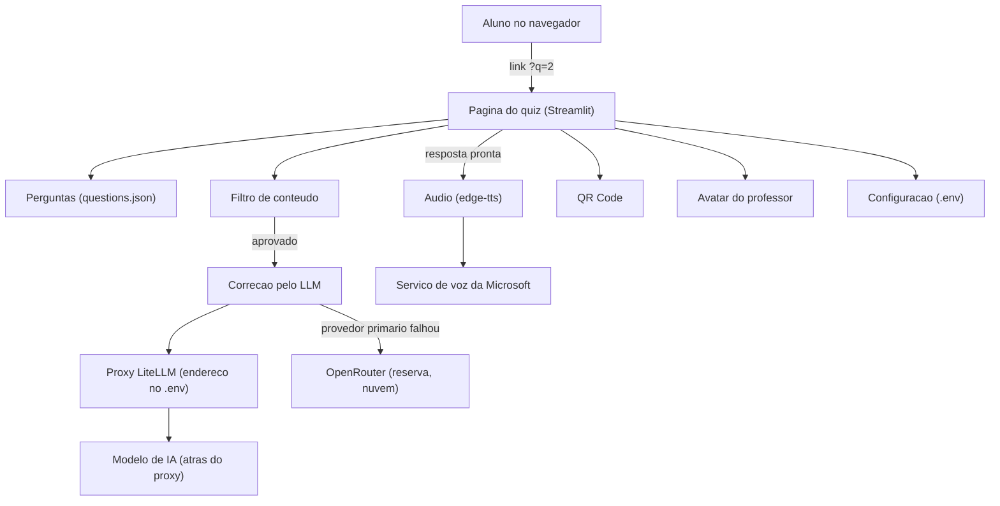

# 02. Arquitetura: as peças e como elas se conversam

**Arquitetura** aqui quer dizer o desenho geral do sistema: quem é o quê, e por qual caminho a informação anda. Pense em uma fachada de loja com o galpão atrás: o aluno só vê a fachada, mas por trás há um estoque, um tradutor e fornecedores de fora — inclusive o da voz.

## O desenho geral

A leitura abaixo vem do `app.py` e dos módulos importados por ele, mais as variáveis descritas em `src/config.py`.

Leia de cima para baixo: o aluno chega, a página monta a tela usando as peças da esquerda, e quando a resposta está pronta ela passa pela correção e pelo áudio, que são os dois ramos que saem da página.

## Cada peça, em português

| Peça | O que é, em uma frase | Fica em |
| --- | --- | --- |
| Página do quiz | O programa que roda no servidor e desenha a tela do aluno a cada clique | `app.py` |
| Perguntas | A gaveta com os enunciados, um arquivo de texto simples | `questions.json` |
| Filtro de conteúdo | O porteiro: primeiro procura palavras proibidas na própria máquina, depois pede uma segunda opinião a um modelo de IA | `src/content_filter.py` |
| Correção pelo LLM | O professor: monta a instrução (o **prompt**, texto de instruções enviado ao modelo) e recebe a explicação | `src/llm_service.py` |
| Proxy LiteLLM | O tradutor: recebe pedidos em um padrão só e repassa para o modelo que estiver configurado; autentica o pedido com uma chave virtual | fora do repositório, endereço e chave no `.env` |
| Modelo de IA (atrás do proxy) | O cérebro que efetivamente escreve a resposta | fora do repositório, dentro do proxy |
| OpenRouter | O fornecedor de reserva, na nuvem, usado só quando o primário falha | fora do repositório, chave no `.env` |
| Audio | Converte o texto da explicação em arquivo de som | `src/tts_service.py` |
| Servico de voz da Microsoft | Quem efetivamente sintetiza a voz (o serviço gratuito por trás do Edge) | fora do repositório, sem chave |
| QR Code | Gera a imagem quadriculada do link da pergunta | `src/qrcode_service.py` |
| Avatar do professor | Desenha e anima o mascote que "fala" durante o áudio | `src/avatar.py` |
| Configuracao | Lê o `.env` e confere se tudo que é obrigatório existe | `src/config.py` |

## Por que existe um tradutor no meio (o proxy)

O programa não conversa direto com o modelo. Ele fala com o **LiteLLM**, que é um programa intermediário: ele expõe um endereço só e converte os pedidos para o formato que cada modelo entende. A analogia é a tomada universal em viagem: você leva um adaptador, liga qualquer aparelho nele, e não precisa carregar um carregador por país.

Do lado do código, essa conversa acontece pela classe `ChatOpenAI` do pacote `langchain-openai` (a biblioteca LangChain): é a mesma interface que se usaria para falar com a OpenAI, só que o parâmetro `base_url` aponta para o endereço do LiteLLM. E a chave que acompanha o pedido, `LITELLM_API_KEY`, é uma **chave virtual**: o proxy tem sistema próprio de contas e orçamento, então aquela chave não abre o modelo — abre a conta local de quem está falando com o proxy.

Vantagens práticas disso:

- Trocar o modelo é mudar uma variável de texto (`LITELLM_MODEL`), não mexer em código.
- *(inferência)* O modelo pode estar na mesma máquina do professor, sem depender de internet nem pagar por token. Base: o docstring de `get_litellm_llm()` diz "LiteLLM server com backend Ollama" e os exemplos de modelo no `config.py` têm cara de arquivo quantizado (`glm-4.7-flash:q4_K_M`, um formato compacto de modelo). A configuração do proxy fica fora deste repositório e não foi verificada.
- O programa continua falando a mesma língua mesmo que o proxy troque de modelo por trás.

## A reserva (fallback): o plano B escrito no código

Em `src/llm_service.py`, a função `evaluate_answer()` faz o seguinte, nesta ordem:

1. Tenta o provedor primário (proxy LiteLLM).
2. Se der qualquer erro, registra o aviso no log e tenta o OpenRouter com o mesmo texto de instrução.
3. Se o segundo também falhar, devolve um erro único que cita **os dois** motivos, e a tela do aluno mostra "Erro ao processar".

É o plano B de qualquer serviço: se o fornecedor principal cai, quem está no balcão liga o reserva. Pelo que se vê no código, essa lógica visível mora em `evaluate_answer()`. Se também existe reserva configurada no proxy LiteLLM ou no próprio OpenRouter, isso fica fora deste repositório e não foi verificado.

> O que a pesquisa mudou aqui: a documentação do LiteLLM mostra que **ele próprio** tem um mecanismo de reserva (chamado de *fallback*, que sai do grupo de modelos que falhou para o próximo grupo) e a do OpenRouter mostra reserva automática entre provedores. Ou seja, havia pelo menos dois caminhos prontos documentados e o código do quiz escreveu o seu próprio, com `try/except` — sem que se saiba se os mecanismos externos também estão ativos em produção. Isso está em [07-pesquisa-e-fontes.md](07-pesquisa-e-fontes.md).

## O que acontece quando falta alguma coisa

| O que caiu | Consequência visível | Base |
| --- | --- | --- |
| Proxy LiteLLM | A avaliação cai automaticamente para o OpenRouter e o aluno nem percebe | `evaluate_answer()` com `try/except` |
| OpenRouter também | "Erro ao processar" na tela, com os dois motivos descritos | mesma função, terceiro passo |
| Só a segunda opinião do filtro | A moderação semântica falha e o texto passa (o código diz: *fail-open*), mas a checagem de palavras locais já rodou antes e continua valendo | comentário em `content_filter.check_text()` |
| Serviço de voz | O envio inteiro falha e aparece "Erro ao processar"; a resposta escrita fica guardada em memória, mas a tela não avança | `generate_speech()` dentro do mesmo `try` |
| Sem internet em geral | O áudio falha (o serviço de voz é online); a avaliação depende dos provedores configurados e não foi testada sem rede — a pergunta, isso sim, é exibida, porque vem de arquivo local | leitura de `src/tts_service.py`, do `.env` e do caminho de dados |
| Variáveis obrigatórias faltando no `.env` | O programa nem larga: lista o que falta e manda copiar o `.env.example` | `validate_config()` chamado no início do `main()` |

## Onde o filtro entra duas vezes

Um detalhe fácil de perder: com a moderação ligada, o mesmo provedor primário é usado **duas vezes** por envio, uma para moderar e outra para corrigir.

1. `check_text()` tenta o filtro local de palavras.
2. Se passou, `check_text_llm()` pede ao modelo um veredicto curto, `SEGURO` ou `BLOQUEAR`.
3. Só então `evaluate_answer()` faz a correção.

O prompt de moderação tem uma exceção escrita à mão: como o quiz fala de instrumentos da saúde, termos como "perfuração de crânio" ou "sangue" são permitidos. Sem essa exceção, um aluno respondendo sério seria barrado pelo próprio filtro.

## Voltando ao começo

Toda essa conversa nasce de um clique. No próximo arquivo, [03-fluxo-principal.md](03-fluxo-principal.md), o mesmo caminho aparece como linha do tempo, passo a passo, do clique até o áudio.

## Inferências desta página

1. *(inferência)* O modelo de IA pode estar na mesma máquina do professor e não pagar por token. Base: o docstring de `get_litellm_llm()` cita backend Ollama e os exemplos de modelo são quantizados; a configuração do proxy fica fora do repositório e não foi verificada.
