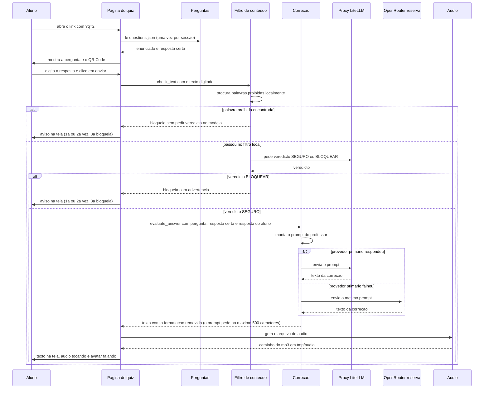

# 03. Fluxo principal: do clique até o áudio

Este é o caminho que todo aluno percorre. Ele está escrito em `app.py`, na função `main()`, na ordem em que o código executa. A leitura vale para qualquer pergunta: troque o número do link e o roteiro é o mesmo.

## Diagrama de sequência

Cada seta é uma passagem de recado entre as peças, de cima (início) para baixo (fim). Os blocos `alt` / `else` são bifurcações: o código faz um ou outro, nunca os dois.

Dois detalhes do diagrama: o veredicto do modelo **só é pedido** se a triagem local deixar o texto passar — se a lista de palavras já barrou, não há chamada de moderação. E quando `MODERATION_ENABLED=false` no `.env`, o bloco inteiro de moderação é pulado e a resposta vai direto para a correção.

## O mesmo caminho em texto corrido

1. **Chegada.** O aluno abre `?q=2`. Na primeira carga da sessão, o programa lê `questions.json` e guarda a lista na memória da sessão. A partir daí, todas as reexecuções do script (clique de botão, envio do campo com Enter ou saída dele) reaproveitam essa lista em vez de reler o arquivo.
2. **Exibição.** O enunciado aparece em uma caixa com sombra, o campo de resposta embaixo, e o QR Code da pergunta já visível, mesmo antes de responder.
3. **Envio.** Ele escreve e clica em **Enviar Resposta**. Resposta vazia? Só um aviso, sem chamada nenhuma para fora.
4. **Portaria.** O texto passa pelo filtro (`check_text()`): primeiro a triagem local de palavras; só se ela deixar passar é que o modelo é consultado para o veredicto `SEGURO`/`BLOQUEAR`. Se essa segunda checagem estiver indisponível, o texto segue (o código chama isso de *fail-open*, ou seja, abre a porta em caso de dúvida), mas a triagem local de palavras já aconteceu antes e não é pulada. Com `MODERATION_ENABLED=false`, o filtro inteiro é pulado.
5. **Advertências.** Primeira falta: aviso. Segunda: aviso dizendo que é a última chance. Terceira: a sessão inteira é marcada como bloqueada e todos os envios seguintes são recusados até recarregar a página.
6. **Correção.** O texto aprovado vai para `evaluate_answer()`, em `src/llm_service.py`, com três informações: o enunciado, a resposta certa e a resposta do aluno. A instrução manda o modelo se comportar como professor entusiasmado, motivar antes de corrigir, explicar o instrumento (o que é, para que serve, como era usado, como foi substituído) e responder em português falado, sem markdown nem HTML. Dentro da função, o provedor primário (LiteLLM, falado pela classe `ChatOpenAI`) é o primeiro a ser tentado; se ele falhar, o mesmo prompt vai para o OpenRouter.
7. **Limpeza.** A resposta volta e passa por `clean_text_for_tts()`, que remove símbolos de formatação (negrito, títulos, trechos de link), transforma quebras de linha em ponto e cola espaços duplos. É uma limpeza parcial: não há validação nem corte no tamanho, então os 500 caracteres são um pedido escrito no prompt e não um limite garantido — e sobras de HTML passam direto pelo filtro.
8. **Voz.** O texto vai para o `edge-tts`, que grava um `.mp3` em `tmp/audio`. Antes de gerar, o módulo apaga arquivos com mais de 24 horas, para a pasta não encher.
9. **Apresentação.** O texto aparece na tela e o áudio toca sozinho com o avatar do professor em movimento. Ao terminar, o avatar volta ao repouso. O binário do áudio viaja embutido na página, em base64 (uma forma de guardar bytes dentro de texto).
10. **Tentar de novo.** O botão limpa a resposta, apaga o áudio da pasta temporária e recarrega a tela com a mesma pergunta.

## Detalhes que só aparecem no código

- **`st.session_state` é a memória da sessão.** Sem ela, o Streamlit executaria o script inteiro de novo a cada interação — clique em botão, envio do campo com Enter ou saída do campo —, e o que estivesse solto na variável local sumiria. Tudo o que precisa sobreviver a essas reexecuções (a lista de perguntas, se já respondeu, o texto da correção, o caminho do áudio, o contador de advertências) mora aí. Ver [04-dados.md](04-dados.md).
- **A ordem importa:** o texto da correção é gravado na memória **antes** de o áudio ser gerado. Se o áudio falhar, o envio reporta erro e a tela não avança, mas o texto já está guardado (ele não aparece, porque a tela só o mostra quando a flag `answered` é verdadeira).
- **O QR Code é gerado a cada exibição da tela**, a partir de `{APP_URL}?q={id}`. Não há cache.
- **O avatar é desenhado por código**, quadro a quadro, com a biblioteca de imagem: a boca abre e fecha enquanto o áudio toca e os olhos piscam de vez em quando. As animações ficam salvas em `assets/` na primeira execução e são reutilizadas depois.
- **O `st.rerun()` do fim do envio** é o que troca a tela do formulário pela tela da resposta, sem recarregar a página inteira no navegador.

## Inferências desta página

1. *(inferência)* A sequência advertência, advertência, bloqueio foi calibrada para sala de aula, onde o professor quer segurar a conversa sem expulsar o aluno no primeiro deslize.
2. *(inferência)* O texto curto e sem formatação é exigido pelo prompt porque o mesmo texto é falado, e fala longa com asterisco não funciona.
