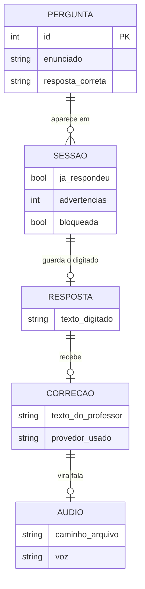

# 04. Dados: onde as informações ficam e como se ligam

## A resposta curta: não há banco de dados

`Banco de dados` é o armário indexado onde um sistema guarda registros para sempre (cadastro de clientes, notas, pedidos). Este projeto não tem nenhum. Tudo o que existe se divide em quatro lugares, e nenhum deles guarda histórico de uso.

| Onde | O que guarda | Por quanto tempo | Arquivo ou chave |
| --- | --- | --- | --- |
| Gaveta das perguntas | Os enunciados e as respostas certas | Enquanto ninguém editar o arquivo | `questions.json` |
| Memória da sessão | O que está acontecendo agora com este aluno | Até fechar a aba | `st.session_state` |
| Pasta de áudios | Os `.mp3` gerados | Apagados na geração seguinte, quando já passaram de 24 horas | `tmp/audio` |
| Cofre de segredos | Endereços e chaves dos serviços | Enquanto não mudar | `.env` (lido por `src/config.py`) |

O avatar gerado (`assets/scientist.gif` e `assets/scientist_idle.gif`) é um quinto lugar, mas é artefato de apresentação, não informação.

## Relacionamentos

O diagrama abaixo mostra as peças de informação e os vínculos entre elas. Leia como frases: "uma pergunta aparece em várias sessões", "uma sessão guarda no máximo uma resposta digitada".



O campo `provedor_usado` do diagrama é conceitual: o código sabe qual provedor respondeu apenas pelo log de aviso que ele registra quando o primário falha. Não existe um registro estruturado guardando isso. *(inferência)* Se um dia for preciso auditar quantas respostas caíram no reserva, esse log é o único lugar a consultar.

## A gaveta das perguntas, por dentro

`questions.json` é uma lista. Cada item tem exatamente três chaves:

```json
{ "id": 1, "question": "…", "correct_answer": "Trépano" }
```

- `id`: número inteiro, é o que aparece no link `?q=1`.
- `question`: o enunciado, aqui escrito em primeira pessoa, como charada.
- `correct_answer`: a resposta esperada. **Ela não aparece na tela como um campo separado nem é comparada literalmente com o que o aluno digitou**: ela viaja dentro do pedido ao LLM, e o prompt manda o modelo explicar a resposta certa — então ela pode aparecer, em palavras, na explicação que volta para a tela.

Duas funções leem essa lista: `load_questions()` abre o arquivo uma vez por sessão, e `get_question_by_id()` varre a lista procurando o `id`. Existe ainda `get_question()`, que busca pela posição (primeira, segunda), mas o `app.py` não usa.

## A memória da sessão, chave por chave

`st.session_state` é o armário temporário de cada visita. As chaves usadas pelo código:

| Chave | Tipo | Papel |
| --- | --- | --- |
| `questions` | lista | A gaveta de perguntas, já lida do arquivo |
| `answered` | lógico | `false` = mostra o formulário; `true` = mostra a correção |
| `response_text` | texto | O comentário do professor, pronto para exibir |
| `audio_file` | caminho | Onde o `.mp3` deste envio foi gravado |
| `moderation_warnings` | número | Contador de advertências (0, 1, 2, depois bloqueia) |
| `moderation_blocked` | lógico | Trava todos os envios seguintes até recarregar |
| `answer_input` | texto | O campo de texto digitado (nomeado pelo próprio Streamlit) |

Se essa memória zerasse, o aluno não perde nada valioso: no máximo precisa digitar de novo. Não há nota, nem progresso, nem pontuação a perder, porque nada disso existe.

Essa memória existe por causa do modelo de execução do Streamlit, que remonta a tela do zero a cada interação — explicado em [03-fluxo-principal.md](03-fluxo-principal.md) e em [07-pesquisa-e-fontes.md](07-pesquisa-e-fontes.md). É também por isso que o fim do envio chama `st.rerun()`: dentro desse modelo, trocar de tela significa rodar o script de novo com a resposta já guardada.

## O caminho dos áudios

1. `generate_speech()` cria a pasta `tmp/audio` se não existir.
2. Antes de gerar, `_cleanup_stale_audio()` apaga tudo que tiver mais de 24 horas (`STALE_AUDIO_SECONDS = 24 * 60 * 60`).
3. Cria um arquivo temporário com nome aleatório (`tempfile.mkstemp`), grava o som nele e devolve o caminho.
4. Falhou? O arquivo parcial é apagado na hora e o erro sobe para a tela, sem deixar lixo.
5. O botão "Tentar novamente" apaga o arquivo da sessão atual.

Na tela, o áudio não é um link para um arquivo no servidor: o conteúdo inteiro do `.mp3` é convertido em base64 e embutido no HTML da página. Vantagem: funciona mesmo que o servidor de arquivos esteja bloqueado. Custo: cada correção envia o som de novo a cada exibição. *(inferência)* Essa escolha combina com um uso de poucos alunos simultâneos, típico de sala.

## Configuração: o que é obrigatório e o que tem padrão

`src/config.py` separa as duas coisas e valida na largada da aplicação.

**Obrigatórias (sem elas o programa não abre):**

| Variável | Papel |
| --- | --- |
| `LITELLM_API_BASE_URL` | Endereço do LiteLLM server (primário), lido do `.env` |
| `LITELLM_API_KEY` | Chave virtual de acesso a esse tradutor |
| `LITELLM_MODEL` | Qual modelo usar no primário |
| `OPENROUTER_API_KEY` | Chave do fornecedor de reserva |
| `OPENROUTER_FALLBACK_MODEL` | Qual modelo usar na reserva |

**Com padrão (dão para deixar como estão):**

`OPENROUTER_BASE_URL` (padrão `https://openrouter.ai/api/v1`), `MODERATION_ENABLED` (`true`), `APP_URL` (`https://lappquiz.ict.unesp.br`), `TTS_VOICE` (`pt-BR-FranciscaNeural`), `TEMP_AUDIO_DIR` (`tmp/audio`).

Detalhe de projeto: a validação é uma função chamada no início do `main()`, e não no momento em que o arquivo é importado. O comentário no código explica o motivo: assim outros arquivos e testes podem importar `src.*` sem ter um `.env` completo na mão. Existe também o interruptor `SKIP_CONFIG_VALIDATION=1`, usado justamente pelos testes.

## Inferências desta página

1. *(inferência)* A ausência de banco de dados é uma escolha de simplicidade para um quiz de sala, não uma limitação.
2. *(inferência)* O embutir do áudio em base64 indica que o esperado é pouca gente ao mesmo tempo.
3. *(inferência)* O campo de qual provedor respondeu só existe no log, então auditoria de uso do reserva não é um relatório pronto hoje.
