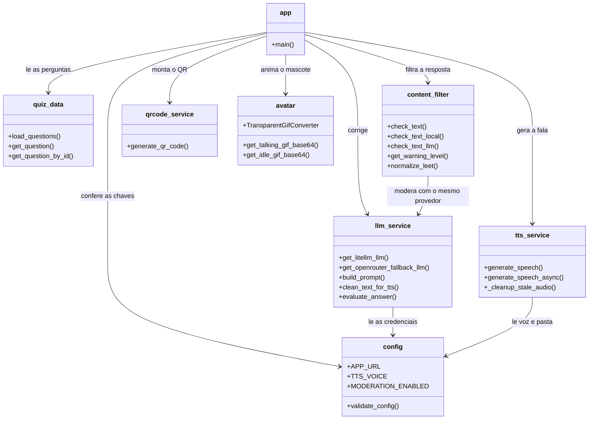

# 05. Componentes: os módulos e o papel de cada um

Aqui o vocabulário é de código: **módulo** é um arquivo com um conjunto de funções sobre um assunto só, e **função** é uma tarefa nomeada que se pode chamar (como um aparelho de cozinha: o liquidificador faz uma coisa, o forno outra). O projeto tem 8 módulos na aplicação e 6 arquivos de teste.

## Diagrama de componentes

As setas dizem "quem chama quem". O `app.py` é o centro: é ele que conversa com todos os outros.

## O que cada arquivo faz, em uma frase

| Arquivo | Linhas | Papel |
| --- | --- | --- |
| `app.py` | 260 | A orquestração: desenha a tela, lê a URL, chama todo mundo na ordem certa |
| `src/llm_service.py` | 112 | Monta a instrução do professor, limpa a resposta e cuida do plano B |
| `src/content_filter.py` | 226 | Duas portarias de moderação: palavras na máquina e veredicto do modelo |
| `src/avatar.py` | 364 | Desenha o cientista quadro a quadro e vira GIF animado |
| `src/config.py` | 58 | Lê o `.env`, valida o obrigatório, expõe as constantes |
| `src/tts_service.py` | 46 | Grava o áudio e faz a faxina dos arquivos velhos |
| `src/quiz_data.py` | 19 | Lê o `questions.json` e procura pergunta por id |
| `src/qrcode_service.py` | 11 | Gera a imagem do QR Code |

Contagem de linhas medida com `wc -l` no estado `2a1e7db`.

## Detalhes que valem a leitura

**`app.py` é deliberadamente "só" orquestração.** Ele não implementa moderação, nem correção, nem áudio: importa as funções e decide a ordem. Essa separação é o que permite testar cada parte isoladamente (ver [06-metodologia.md](06-metodologia.md)), e é a razão de existir uma pasta `src/` em vez de um arquivo gigante.

**`llm_service.py` é o único ponto que toca os dois provedores de IA.** As funções `get_litellm_llm()` e `get_openrouter_fallback_llm()` constroem o mesmo tipo de objeto, `ChatOpenAI` (do pacote `langchain-openai`), apontando `base_url` e chave para o LiteLLM ou para o OpenRouter. `evaluate_answer()` decide qual dos dois usar — e é também quem converte falha dos dois em um único `RuntimeError`.

**`content_filter.py` tem duas defesas e uma exceção de projeto.** A primeira é a lista de palavras proibidas em português e inglês, mais alguns padrões regulares (expressões que descrevem formato, como "porra"). Antes de comparar, `normalize_leet()` deixa o texto em minúsculas e aplica uma tabela de dígitos que, na prática, troca `4` por `3` e `3` por `8` (os testes cobrem exatamente essa troca). Repare que a fama de caça ao *leet* é maior do que o feito: "p1r0c4" vira "p1r0c3" e escapa da lista — quem **pode** identificar esse texto esquisito é a segunda defesa, o veredicto do modelo: se o provedor estiver indisponível, porém, o `except` de `check_text()` libera o texto mesmo assim (fail-open). A exceção de projeto está no prompt da moderação: palavras de procedimento odontológico (crânio, sangue, cirurgia) são permitidas, porque o assunto do quiz é esse.

**`avatar.py` é o arquivo maior, e é puro desenho.** `TransparentGifConverter` existe por um motivo bem específico: o formato GIF só tem uma cor de transparência, então o conversor remapeia a paleta para que o fundo do mascote suma de verdade. `generate_talking_gif_bytes()` cria a animação com a boca abrindo e fechando, e aceita uma duração para casar com o tamanho do áudio.

**`config.py` separa "falta" de "tem valor errado".** Ele só confere se a variável existe; endereço mal escrito ele deixa passar e o erro aparece depois, quando a chamada de rede falha. *(inferência)* É uma escolha de simplicidade: validar o formato de URL e chave não valeria o custo para um app de sala.

**`qrcode_service.py` é o menor módulo e não tem lógica nenhuma.** Ele monta a imagem e devolve em memória, sem gravar arquivo. Exemplo mínimo do projeto de como isolar uma dependência: trocar a biblioteca de QR não mexe em mais nada.

## Como isso se liga aos testes

Cada módulo tem seu arquivo de teste, e a correspondência é direta:

| Módulo | Teste | Testes |
| --- | --- | --- |
| `src/content_filter.py` | `tests/test_content_filter.py` | 163 linhas |
| `src/llm_service.py` | `tests/test_llm_service.py` | 119 linhas |
| `app.py` | `tests/test_app.py` | 128 linhas |
| `src/quiz_data.py` | `tests/test_quiz_data.py` | 49 linhas |
| `src/config.py` | `tests/test_config.py` | 22 linhas |
| `src/qrcode_service.py` | `tests/test_qrcode_service.py` | 11 linhas |

Os testes não chamam nenhum serviço de verdade: `tests/conftest.py` injeta variáveis falsas de ambiente e `test_llm_service.py` usa `unittest.mock` (um dublê que responde no lugar do serviço) para simular a resposta do modelo. Por isso o conjunto inteiro roda em menos de um segundo, mesmo sem chave nenhuma.

Não há teste para `src/avatar.py` nem para `src/tts_service.py`, os dois módulos que mais dependem de recursos externos (desenho pesado e rede). Isso é leitura do que existe em `tests/`.

## Inferências desta página

1. *(inferência)* Validar só a presença das variáveis de ambiente (e não o formato de URL ou chave) é uma escolha de simplicidade para um aplicativo de sala. Base: o código de `config.py` confere apenas se a variável está definida e deixa o resto para a falha em rede.
