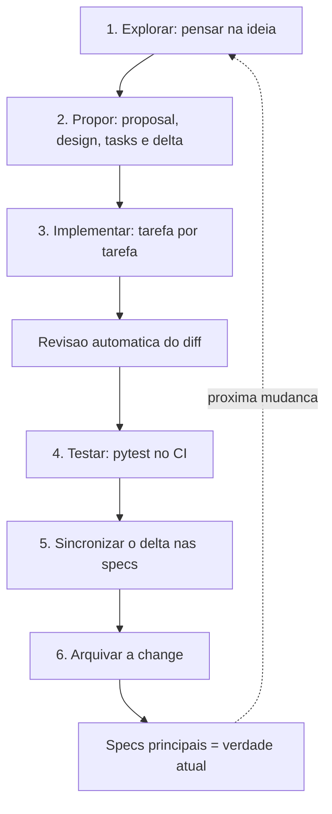

# 06. Metodologia: como este projeto é construído

A pergunta que esta peça responde é: **antes de existir uma linha nova de código, o que decide que aquela linha vai existir?** No quiz, a resposta é um conjunto de quatro práticas que se encaixam: especificar, testar, revisar e higienizar.

A analogia mais próxima é a de uma obra bem dirigida: existe a planta antes da parede, o teste de nível antes do reboco, o mestre de obras que confere a cada etapa e uma vistoria semanal para achar o que afrouxou.

## As quatro camadas, em resumo

| Camada | Pergunta que ela responde | Ferramenta no repositório |
| --- | --- | --- |
| Especificar | O que exatamente vamos construir e como saberemos que ficou pronto? | OpenSpec, em `openspec/` |
| Testar | O código novo quebrou alguma coisa que já funcionava? | `pytest`, em `tests/`, rodando no CI do GitHub |
| Revisar | O diff (as mudanças propostas) tem problema que eu não enxerguei? | Revisão automatizada por IA, em `.github/workflows/` |
| Higienizar | O repositório está ficando sujo, com documento velho ou link morto? | Auditoria semanal, em `.github/workflows/repository-hygiene.yml` |

## 1. Especificar antes de codar: OpenSpec

**OpenSpec** é uma forma de desenvolvimento guiado por especificação (em inglês, *spec-driven development*): primeiro se escreve, em português claro, como o sistema deve se comportar; depois se escreve o código que cumpre aquilo. Não é ferramenta exótica: é pasta de arquivos `.md` que qualquer pessoa lê.

Três conceitos, com analogia:

- **Spec** (especificação) é a planta da obra: descreve como o sistema é **hoje**, não como ele será. Fica em `openspec/specs/`. O repositório tem **10 specs** (439 linhas no total): `quiz-ui`, `llm-evaluation`, `llm-fallback`, `content-filter`, `tts`, `avatar`, `question-link-qr-code`, `independent-question-access`, `readme-documentation`, `repository-documentation`.
- **Change** (mudança) é a ficha da obra que está começando: uma pasta com `proposal.md` (o que e por quê), `design.md` (as decisões técnicas), `tasks.md` (a lista de tarefas com caixinhas) e o **delta**, a alteração proposta para a spec, escrita como diferença em relação ao que já vale. Fica em `openspec/changes/<nome-da-mudanca>/`.
- **Archive** (arquivo) é o fim da obra: as caixinhas foram todas marcadas, o delta é aplicado sobre a spec principal, e a pasta vira histórico em `openspec/changes/archive/`, com a data no nome.

O repositório tem **8 mudanças já arquivadas**, todas legíveis como diário do projeto:

| Pasta arquivada | O que registra |
| --- | --- |
| `2026-07-14-cleanup-phantom-features` | Remoção de funcionalidades que só existiam na descrição |
| `2026-07-20-independent-question-links` | Link e QR Code por pergunta, independentes entre si |
| `2026-07-28-add-ci-workflow` | Criação do CI que roda os testes |
| `2026-07-28-add-pytest-suite` | Criação da suíte de testes |
| `2026-07-28-update-readme` | Reescrita do README |
| `2026-08-03-fix-qr-code-redirect` | Correção do redirecionamento do QR Code |
| `2026-08-24-migrate-to-litellm` | Migração para o LiteLLM com reserva no OpenRouter |
| `2026-10-06-documentacao-permanente` | Documentação permanente em `docs/` e links do README corrigidos |

Uma regra importante está escrita em `openspec/config.yaml`:

> "MANDATORY: Sync delta specs to main specs during archive. Run openspec-sync-specs BEFORE archiving the change."

Em português: na hora de arquivar, é obrigatório primeiro juntar o delta na spec principal, senão a planta da obra deixa de descrever a obra. É exatamente essa regra que existe para evitar o tipo de problema encontrado no README (seção "Onde o README estava fora do próprio spec").

### O ciclo completo

Os documentos de uma change se encadeiam respondendo, em ordem, por quê, o quê, como e quais passos: `proposal.md` (por quê), os deltas em `specs/` (o quê), `design.md` (como), `tasks.md` (passos) — e a implementação, tarefa por tarefa, fecha o ciclo. Depois disso, o archive dobra a mudança de volta para a verdade das specs principais.

Uma observação de honestidade: a numeração acima é a ordem lógica documentada pelo próprio OpenSpec e a ordem em que as mudanças arquivadas aparecem no histórico do git. *(inferência)* Não existe, dentro do repositório, uma regra automatizada que **obrigue** alguém a abrir uma change antes de commitar: quem garante isso é o hábito de quem trabalha no repositório. O que existe é a regra `archive` do `openspec/config.yaml` — uma instrução de processo escrita em texto, para ser seguida por quem executa o archive —, e não foi encontrada nenhuma trava automática que a imponha.

## 2. Testar sempre: pytest e o CI

**CI** (integração contínua) é um robô do GitHub que recebe cada envio de código, monta um ambiente limpo do zero e roda a verificação combinada. Se falhar, o erro aparece antes de a proposta ser mergeada (unida) ao código.

No quiz, o CI é o arquivo `.github/workflows/test.yml`: em todo envio para `main` e em toda proposta de merge, ele instala as dependências no Ubuntu com Python 3.10 e roda `pytest`.

A suíte tem **6 arquivos de teste e 50 testes**, executada na escrita desta página com o mesmo `pytest` da CI: `50 passed`.

Três decisões de método que aparecem no código dos testes:

- **Nenhum teste chama serviço de verdade.** `tests/conftest.py` injeta variáveis de ambiente fictícias (`http://litellm-test:4000`, chaves de teste) e os testes do LLM usam `mock` (um dublê que finge ser o serviço e devolve a resposta ensaiada). Isso mantém a suíte em menos de um segundo e livre de internet e de chave.
- **A configuração é validada no início, não na importação,** justamente para que os testes possam importar os módulos sem ter `.env` completo. É uma decisão de projeto a serviço do método de teste, documentada no comentário de `validate_config()`.
- **O `pytest.ini` fixa `pythonpath = src` e `testpaths = tests`,** então `pytest` isolado já roda no lugar certo, sem argumento nenhum — inclusive fora do CI.

## 3. Revisar: a segunda opinião automatizada

Os arquivos `.github/workflows/mira-review.yml` e `mira-push-review.yml` chamam uma revisão de código feita por IA (o robô aqui chama-se Mira) sobre cada proposta de merge. Três detalhes de método valem registro:

- **A lógica mora em outro repositório** (um *workflow* reutilizável, ou seja, um roteiro guardado em um lugar só e invocado de vários projetos), fixado por um código de versão imutável (SHA), para que uma mudança lá fora não mude o comportamento aqui sem aviso. O histórico mostra o pin inicial em 29 de setembro de 2026 e dois commits de 3 de outubro de 2026 apenas atualizando esse código fixado, depois de um ajuste no robô.
- **O comportamento é ajustado por arquivo, não por código:** `.mira.yaml` limita a 5 comentários por revisão, ativa o passeio guiado pelo diff e pede 5 linhas de contexto em volta de cada comentário. Poucos comentários é uma escolha: revisão que cospe 40 apontamentos não é lida.
- **Existe revisão também para envio direto no `main`.** O `push-review` cobre o caminho que a revisão de proposta não vê: mudanças enviadas direto para a branch principal. O comentário dentro do workflow explica um problema medido na prática: o robô anuncia o início da revisão com um comentário, esse comentário aciona o próprio robô de novo, e a nova execução tentava cancelar a que estava rodando. A saída foi separar o robô dos humanos em filas diferentes.

Quem quiser repetir a revisão, comenta `@mira-review` na proposta.

## 4. Higienizar: a vistoria semanal

`.github/workflows/repository-hygiene.yml` roda o pacote `repository-hygiene` toda segunda-feira às 6h UTC (3h da manhã, horário de Brasília) — o `cron: "0 6 * * 1"` é lido pelo GitHub Actions em UTC —, além de disparar quando mudam arquivos de documentação, configuração de CI ou o próprio `auditoria.yaml`. Ele publica o relatório e pode abrir uma issue (um registro de pendência) quando encontra problema.

O `auditoria.yaml` que regula esse pacote é explícito sobre links: a regra `broken_internal_links` está `enabled: true` com `severity: error` — exatamente o tipo de problema que o README tinha (próxima seção).

Esse mecanismo existe, mas os links mortos do README permaneceram no ar até esta mudança, e a causa foi verificada comparando a configuração do repositório com o código do pacote: o workflow fixava `repository-hygiene==0.2.0` até esta correção, que subiu o pino para `1.1.0`, e a versão publicada [`0.2.0` no PyPI](https://pypi.org/project/repository-hygiene/0.2.0/) lê o bloco `regras:` (em português), enquanto o `auditoria.yaml` usa `rules:` (em inglês) desde a alteração registrada em 26 de julho de 2026 — a versão [`1.0.0` no PyPI](https://pypi.org/project/repository-hygiene/1.0.0/) já lê `rules:`, confirmando o diagnóstico. Sem nenhuma regra carregada, a auditoria termina com sucesso sem examinar um único arquivo — por isso os links mortos do README nunca geraram alerta. O repin para 1.1.0 devolve a auditoria ao funcionamento.

## Extras que completam o método

- **Commits convencionais.** As mensagens seguem o padrão `tipo: descrição` (`fix:`, `chore:`, `ci:`, `docs:`, `test:`), o que permite filtrar o histórico por natureza da mudança.
- **Propostas de merge com histórico.** O git tem 135 commits entre 20 de maio e 6 de outubro de 2026, com merges no padrão `Merge pull request #N`.
- **Atualização automática de ações.** O `.github/dependabot.yml` pede atualização semanal das ações do GitHub Actions (inclui os workflows reutilizáveis) em PRs revisáveis. Detalhe de segurança: os pacotes usados em CI são fixados por versão (`pip==25.1.1`, `repository-hygiene==1.1.0`) e os reutilizáveis de revisão estão fixados por SHA.

## Onde o README estava fora do próprio spec

Este é o achado de verificação do repositório, e ele ilustra a metodologia melhor que qualquer explicação: a spec `readme-documentation` exige que "o README só faça link para arquivos que existam no repositório", e ainda trazia um cenário chamado "a documentação de destino é mantida no OpenWiki".

O problema: a pasta `openwiki/` foi removida no commit `2a1e7db` (3 de outubro de 2026), e o README continuou

1. listando `openwiki/` na seção "Estrutura principal";
2. linkando as 7 páginas dessa pasta (quickstart, arquitetura, workflows, operações, testes, mapa de fontes, integrações).

Ou seja: o cenário da spec que mandava linkar o OpenWiki ficou sem objeto, e os sete links restantes estavam quebrados. Confirmado com `grep -n openwiki README.md` no estado `2a1e7db`.

A correção acontece dentro do próprio ciclo: a change `documentacao-permanente` apaga as linhas mortas do README, aponta a documentação detalhada para `docs/` e incorpora à spec `readme-documentation` o delta que retira o cenário do OpenWiki e mantém a exigência de que todo link resolva para um destino existente. Depois do archive, a spec volta a descrever o que o README faz de verdade — exatamente o papel da regra de sincronização do `openspec/config.yaml`.

## O que foi verificado com as minhas próprias mãos

| Verificação | Resultado |
| --- | --- |
| Rodar a suíte de testes do zero | `50 passed` com `pytest` local, usando a mesma configuração da CI (`pythonpath = src`); 8 arquivos em `tests/`, sendo 6 módulos de teste |
| Contar as specs e mudanças | 10 specs (439 linhas), 8 mudanças arquivadas |
| Contar o histórico | 135 commits, de 2026-05-20 a 2026-10-06 |
| Conferir o horário da vistoria semanal | `cron: "0 6 * * 1"` = 6h UTC, ou 3h da manhã em Brasília |
| Conferir por que a auditoria não alertou | causa verificada comparando a configuração do repositório com o código do pacote: [`0.2.0`](https://pypi.org/project/repository-hygiene/0.2.0/) lê `regras:` e [`1.0.0`](https://pypi.org/project/repository-hygiene/1.0.0/) lê `rules:`, enquanto o `auditoria.yaml` usa `rules:` desde 2026-07-26 — sem regras carregadas, a execução termina sem examinar nada; o pino foi subido para `1.1.0` nesta correção |
| Conferir o endereço público | `lappquiz.ict.unesp.br` respondeu HTTP 200 com a página do Streamlit (conteúdo não inspecionado em navegador) |
| Conferir os links do README e desta documentação | todos os destinos existem no repositório |

## Inferências desta página

1. *(inferência)* A obrigatoriedade de abrir uma change antes de codar é cultural, não automatizada: não há trava de branch que exija isso.
2. *(inferência)* A escolha por revisão com poucos comentários e por fixar a ferramenta por SHA revela um método já refinado por experiência própria com robô revisor.
