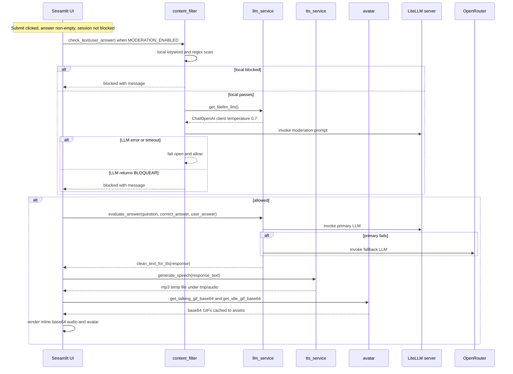

# Architecture Overview

Quiz do Professor is a single-page Streamlit application (Brazilian Portuguese) that presents open-ended questions about historical dental instruments, evaluates free-text student answers with an LLM, and reads the feedback aloud through a cartoon "professor" avatar. There is no database, no authentication, and no sequential navigation — each question is an independent page addressed by a URL query parameter.

## Module Split

`app.py` is the sole Streamlit entry point and orchestrator. It owns all UI rendering, session state, and request routing, and delegates work to a focused set of modules under `src/`:

| Module | Responsibility |
|---|---|
| `src/config.py` | Loads `.env` via `python-dotenv`, exports config constants, and provides `validate_config()` |
| `src/quiz_data.py` | Loads `questions.json` and looks up questions by `id` or list index |
| `src/content_filter.py` | Two-layer content moderation: local keyword/regex blocklist plus optional LLM semantic check |
| `src/llm_service.py` | LLM evaluation with a LiteLLM primary provider and an OpenRouter fallback, plus TTS text cleaning |
| `src/tts_service.py` | `edge-tts` wrapper that synthesizes MP3 audio to a temp file |
| `src/qrcode_service.py` | Generates a QR-code PNG encoding a question's shareable URL |
| `src/avatar.py` | PIL-drawn cartoon scientist GIFs (talking and idle), generated on first run and cached to disk under `assets/` |

`app.py` imports a single public function from each of these modules and wires them together inside `main()`.

## Request Pipeline

The diagram below traces a single answer submission from the Streamlit UI through moderation, two-tier LLM evaluation, TTS, and avatar rendering.

Answer-submission pipeline: moderation gate, two-tier LLM evaluation (LiteLLM primary with OpenRouter fallback), edge-tts speech, and inline base64 avatar rendering.

## Answer Submission Data Flow

Questions are accessed individually via URL query parameters (`?q=<id>`), not sequentially. A user navigates to a specific question URL (optionally via a QR code), types an answer, and submits.

1. **Page load** — `st.query_params` reads the `q` parameter; `get_question_by_id()` looks up the question by numeric `id`. Missing `q` shows an info message; a non-integer shows an invalid-ID error; an unknown id shows a not-found error.
2. **User types answer** — Streamlit `text_input` widget.
3. **Submit clicked** — `st.button("Enviar Resposta")`. An empty answer shows a warning; a blocked session shows a block error and stops.
4. **Content moderation** (only when `MODERATION_ENABLED` is true) — `check_text()` in `content_filter.py`:
   - First pass: local keyword + regex pattern matching (`check_text_local`), with leet-speak normalization — fast, no API cost.
   - Second pass: LLM semantic check via the LiteLLM primary client (`get_litellm_llm()`), only if the local pass succeeds.
   - Blocked? → increment `moderation_warnings`, escalate, or block the session at three strikes.
5. **LLM evaluation** — `evaluate_answer()` in `llm_service.py`:
   - Builds a prompt (`ChatPromptTemplate`) with the question, correct answer, and user answer.
   - Invokes the LiteLLM primary (`LITELLM_MODEL`); on failure, falls back to OpenRouter (`OPENROUTER_FALLBACK_MODEL`).
   - If both providers fail, raises a `RuntimeError` describing both errors.
   - Strips markdown/links and normalizes whitespace via `clean_text_for_tts()` so the response is clean for speech.
6. **TTS generation** — `generate_speech()` in `tts_service.py` synthesizes the cleaned text to an MP3 temp file under `tmp/audio/` via `edge-tts`.
7. **Avatar animation** — `get_talking_gif_base64()` and `get_idle_gif_base64()` return base64-encoded GIFs (loaded from the disk cache under `assets/`, generating them on first run).
8. **Display** — Streamlit rerenders with the response text, an inline `<audio>` element (base64-encoded MP3), and the avatar `` whose `onplay`/`onended` JavaScript events swap between the talking and idle GIFs during playback.

## Question Access and QR Code Sharing

Each question is an independent page addressed by `{APP_URL}?q=<question_id>`.

- On page load, `app.py` reads `st.query_params.get("q")` and parses it as an integer.
- If no `q` parameter is present, the app shows an info message directing the user to a `?q=<id>` link.
- If the ID is invalid (not an integer) or not found, an error message is displayed.
- At the bottom of every question page, `generate_qr_code()` from `src/qrcode_service.py` renders a QR code encoding the question's shareable URL, letting students scan and open a specific question on mobile devices. `APP_URL` defaults to `https://lappquiz.ict.unesp.br` and is overridable via the environment.

## Session State Model

All quiz state lives in `st.session_state` (Streamlit's per-browser-tab state). State is initialized once on first load and mutated as the user answers:

| Key | Type | Purpose |
|---|---|---|
| `questions` | `list[dict]` | Loaded question bank from `questions.json` |
| `answered` | `bool` | Whether the current question has been answered |
| `response_text` | `str` | LLM evaluation text (cleaned for TTS) |
| `audio_file` | `str\|None` | Path to the generated MP3 temp file |
| `moderation_warnings` | `int` | Count of content-filter hits |
| `moderation_blocked` | `bool` | Whether the session is blocked (3+ warnings) |

No database or persistent storage exists. Closing the browser tab loses all progress. The "Tentar novamente" button resets `answered`, clears `response_text`, deletes the temp audio file, and reruns.

## Configuration and Validation

`src/config.py` loads `.env` at import time via `python-dotenv` and exports module-level constants read from the environment:

| Constant | Env var | Required | Default |
|---|---|---|---|
| `LITELLM_API_BASE_URL` | `LITELLM_API_BASE_URL` | yes | — |
| `LITELLM_API_KEY` | `LITELLM_API_KEY` | yes | — |
| `LITELLM_MODEL` | `LITELLM_MODEL` | yes | — |
| `OPENROUTER_API_KEY` | `OPENROUTER_API_KEY` | yes | — |
| `OPENROUTER_FALLBACK_MODEL` | `OPENROUTER_FALLBACK_MODEL` | yes | — |
| `OPENROUTER_BASE_URL` | `OPENROUTER_BASE_URL` | no | `https://openrouter.ai/api/v1` |
| `MODERATION_ENABLED` | `MODERATION_ENABLED` | no | `true` |
| `APP_URL` | `APP_URL` | no | `https://lappquiz.ict.unesp.br` |
| `TTS_VOICE` | `TTS_VOICE` | no | `pt-BR-FrancishaNeural` |
| `TEMP_AUDIO_DIR` | `TEMP_AUDIO_DIR` | no | `tmp/audio` |

`validate_config()` runs at application startup (called from `main()` in `app.py`) and raises a `ValueError` listing any missing required variable. It is **not** invoked at import time, so importing `src.*` modules does not require a complete `.env`. Setting `SKIP_CONFIG_VALIDATION=1` short-circuits the check entirely, which is how the test suite imports the modules without real credentials. `app.py` additionally guards on `OPENROUTER_API_KEY` and shows a Streamlit error if it is unset.

## Content Moderation

Two-layer moderation in `content_filter.py`:

**Layer 1 — local keyword/pattern check** (`check_text_local`):
- `BLOCKED_KEYWORDS`: a set of Portuguese and English sexual and violent terms.
- `BLOCKED_PATTERNS`: regex patterns targeting obfuscated spellings.
- `normalize_leet()` applies a leet-speak character translation and lowercases before matching.
- Zero API cost, instant.

**Layer 2 — LLM semantic check** (`check_text_llm`):
- Runs only if Layer 1 passes and `use_llm` is true (the default).
- Uses the LiteLLM primary client from `get_litellm_llm()` (temperature 0.7).
- The moderation prompt is medical/dental-context aware: it explicitly permits clinical terms such as surgery, blood, and skull perforation.
- Returns `SEGURO` (safe) or `BLOQUEAR` (block); a response starting with `bloquear` is treated as blocked.
- **Fails open:** if the moderation LLM raises (timeout, auth error, etc.), `check_text` swallows the exception and lets the text through. The local blocklist is the primary defense; LLM moderation is best-effort.

**Warning escalation**: `get_warning_level(warnings)` maps the running `moderation_warnings` count to `none` (0), `first` (1), `second` (2), and `blocked` (3+). Three violations set `moderation_blocked` in session state; the user must reload the page to continue.

## LLM Evaluation

`src/llm_service.py` implements a two-tier provider strategy with LangChain `ChatOpenAI`:

- **Primary** — `get_litellm_llm()` points `ChatOpenAI` at `LITELLM_API_BASE_URL` using `LITELLM_MODEL` (e.g. `glm-4.7-flash:q4_K_M`) and `LITELLM_API_KEY`, at temperature 0.7.
- **Fallback** — `get_openrouter_fallback_llm()` points `ChatOpenAI` at `OPENROUTER_BASE_URL` (OpenRouter's OpenAI-compatible endpoint) using `OPENROUTER_FALLBACK_MODEL` (e.g. `nvidia/nemotron-3-nano-30b-a3b:nitro`) and `OPENROUTER_API_KEY`, at temperature 0.7.
- `evaluate_answer()` invokes the primary first; on any exception it logs a warning and invokes the fallback; if both fail it raises a `RuntimeError` whose message includes both the primary and fallback errors.
- Both the primary and fallback responses are passed through `clean_text_for_tts()`, which strips markdown emphasis/headers, collapses link syntax to its label text, and normalizes whitespace for natural speech.

The evaluation prompt instructs the model to act as a friendly quiz professor, state whether the answer is correct, explain the correct answer didactically, respond in spoken Brazilian Portuguese without markdown, keep responses under 500 characters, and politely refuse inappropriate content.

## Avatar System

The avatar is a programmatically drawn cartoon scientist using PIL (`Pillow`). No character image assets are bundled; `assets/scientist.gif` and `assets/scientist_idle.gif` are generated and cached on first run.

- `_draw_scientist_frame(mouth_open_factor, is_blinking, eye_offset)` draws a single RGBA frame with parametric mouth, eyes, glasses, nose, and lab coat.
- `generate_talking_gif_bytes(audio_duration_seconds)` builds a multi-frame talking GIF (10 FPS, mouth animated via a `sin` wave, blinks every 10th frame). When an audio duration is supplied the GIF matches it and plays once; otherwise it defaults to 20 frames with an infinite loop.
- `generate_idle_gif_bytes()` builds a 48-frame, 6-second idle loop with the mouth closed and an occasional blink.
- `TransparentGifConverter` converts RGBA frames to palette-mode GIFs with transparency index 0.
- `get_talking_gif_base64()` / `get_idle_gif_base64()` return base64 strings, loading from the disk cache and regenerating on cache miss.

`app.py` renders the avatar as inline HTML: an `` showing the talking GIF, with an `<audio autoplay controls>` element whose `onplay` and `onended` JavaScript handlers swap the image source between the talking and idle GIFs during playback.

## TTS Generation

`src/tts_service.py` wraps `edge-tts`. `generate_speech(text)` ensures `TEMP_AUDIO_DIR` exists, allocates a temp `.mp3` path via `tempfile.mkstemp`, and runs the async `edge_tts.Communicate` synthesis under `asyncio.run` using the `TTS_VOICE` voice (default `pt-BR-FranciscaNeural`). On failure it removes the temp file and raises a `RuntimeError`. The returned path is stored in `st.session_state.audio_file` and deleted when the user retries.
