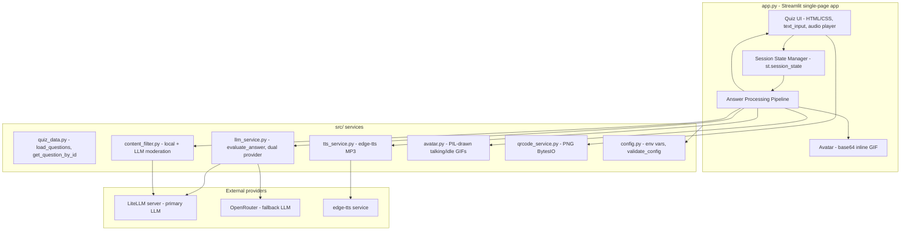
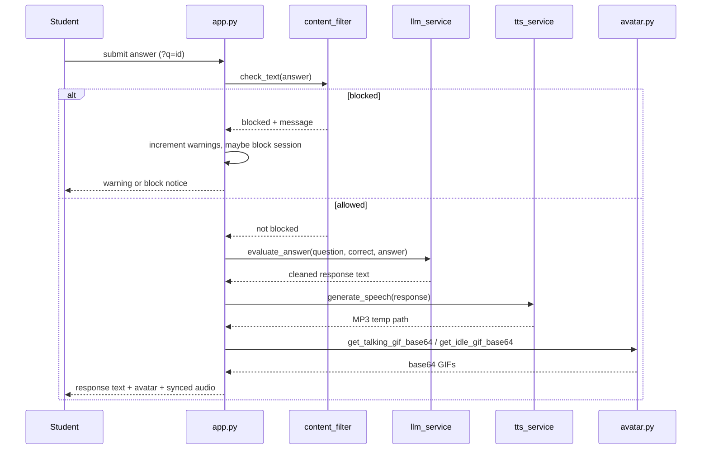
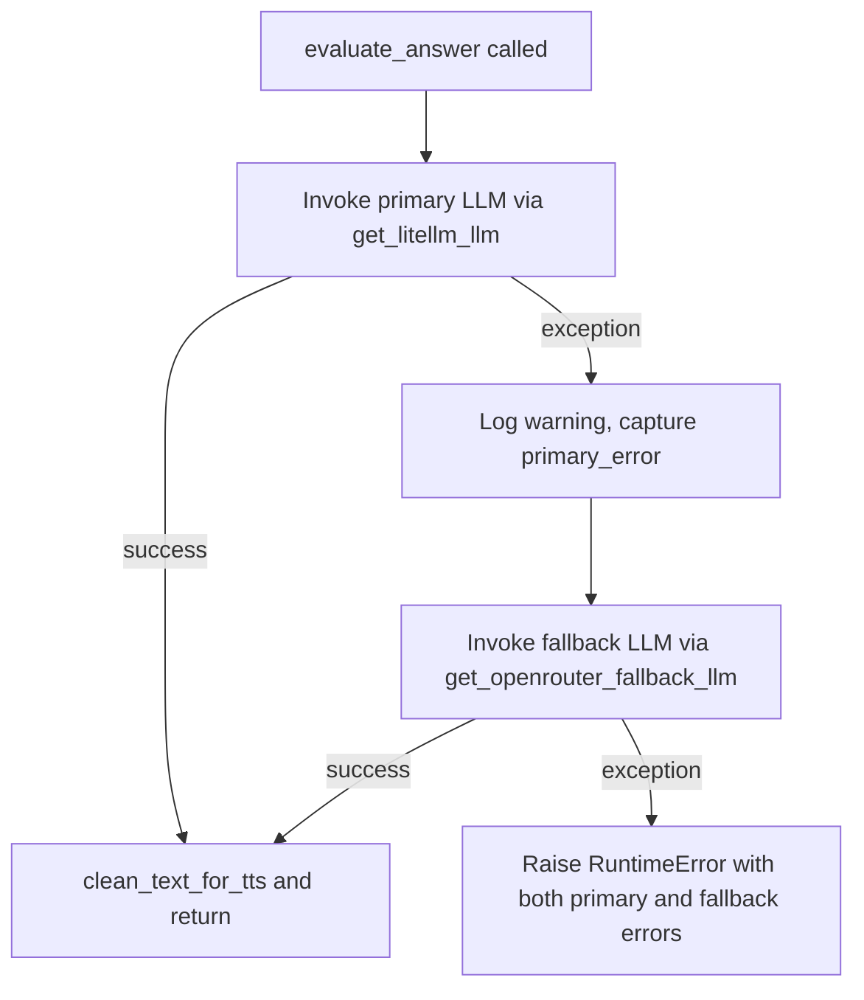

# Architecture

Quiz do Professor is a single-page Streamlit application (UI text and LLM prompts in Brazilian Portuguese, pt-BR) that evaluates free-text student answers with an LLM, narrates the feedback with text-to-speech, and presents it through an animated professor avatar. Questions are addressed individually by URL rather than navigated sequentially, and each question page carries a QR code so students can open it on a mobile device.

## Component Overview

*The Streamlit app orchestrates the answer-processing pipeline, delegating to src/ services that each own one concern and call external providers as needed.*

### Service responsibilities

| Component | File | Responsibility |
|---|---|---|
| App entrypoint | `app.py` | Streamlit page config, query-param routing, submit handling, result rendering, QR display |
| Configuration | `src/config.py` | Loads `.env`, defines required env vars, `validate_config()` startup guard |
| Quiz data | `src/quiz_data.py` | Loads `questions.json`, looks up questions by numeric `id` |
| Content filter | `src/content_filter.py` | Two-layer moderation: local keyword/pattern check + optional LLM semantic check |
| LLM service | `src/llm_service.py` | Builds the evaluation prompt, dual-provider invocation, markdown stripping |
| TTS service | `src/tts_service.py` | edge-tts speech synthesis to a temp MP3 |
| Avatar | `src/avatar.py` | Programmatically draws PIL talking/idle GIFs, disk-cached |
| QR service | `src/qrcode_service.py` | Generates a PNG `BytesIO` QR code for the question URL |

## Answer-Submission Data Flow

Questions are accessed individually via URL query parameters (`?q=<id>`), not sequentially. A student navigates to a specific question URL (optionally via a QR code), types an answer, and submits.

1. **Page load** — `app.py` initializes `st.session_state` on first run (questions, answered, response_text, audio_file, moderation_warnings, moderation_blocked) and calls `validate_config()`.
2. **Question routing** — `st.query_params.get("q")` is parsed as an integer; `get_question_by_id()` looks up the question in the loaded bank. Missing `q` shows an info message; invalid or not-found IDs show an error.
3. **Answer entry** — `st.text_input` collects the answer; `st.button("Enviar Resposta")` triggers submission.
4. **Content moderation** — if `MODERATION_ENABLED` (default true), `check_text()` runs before evaluation. A blocked result increments `moderation_warnings` and `get_warning_level()` escalates: first warning, second warning, then session block at three strikes. A blocked session (`moderation_blocked`) refuses further submissions until the page is reloaded.
5. **LLM evaluation** — `evaluate_answer(question, correct_answer, user_answer)` builds a pt-BR system+human prompt, invokes the LLM through the dual-provider chain, and strips markdown via `clean_text_for_tts()` for clean speech.
6. **TTS generation** — `generate_speech(response_text)` synthesizes an MP3 via edge-tts into `TEMP_AUDIO_DIR` (default `tmp/audio/`).
7. **Avatar + audio playback** — `get_talking_gif_base64()` and `get_idle_gif_base64()` return base64 GIFs; `app.py` inlines them with the base64 MP3 in an HTML `<audio>` element whose `onplay`/`onended` JavaScript swaps the talking and idle GIFs.
8. **Retry** — "Tentar novamente" resets `answered`, clears `response_text`, and deletes the temp audio file before `st.rerun()`.

*End-to-end answer flow, showing moderation gating evaluation and the three output artifacts (text, avatar, audio) rendered together.*

## Dual-LLM Provider Fallback Chain

`src/llm_service.py` provides two LangChain `ChatOpenAI` LLM builders and `evaluate_answer()` chains them with failover:

- **Primary** — `get_litellm_llm()` targets a **LiteLLM server** (`LITELLM_API_BASE_URL`, e.g. `http://localhost:4000`) using `LITELLM_MODEL` (e.g. an Ollama-backed model) and `LITELLM_API_KEY`.
- **Fallback** — `get_openrouter_fallback_llm()` targets **OpenRouter** (`OPENROUTER_BASE_URL`, default `https://openrouter.ai/api/v1`) using `OPENROUTER_FALLBACK_MODEL` and `OPENROUTER_API_KEY`.

Both run at temperature 0.7. `evaluate_answer()` invokes the primary; on any exception it logs a warning and invokes the fallback; if the fallback also fails it raises a `RuntimeError` containing both the primary and fallback errors. This dual-provider design replaces the earlier single OpenRouter/DeepSeek configuration.

*The fallback chain: LiteLLM is tried first, OpenRouter on failure, and a combined RuntimeError only if both fail.*

### Required environment variables

`src/config.py` declares five required variables validated at startup by `validate_config()` (skipped when `SKIP_CONFIG_VALIDATION=1`): `LITELLM_API_BASE_URL`, `LITELLM_API_KEY`, `LITELLM_MODEL`, `OPENROUTER_API_KEY`, and `OPENROUTER_FALLBACK_MODEL`. If any is missing, `validate_config()` raises a `ValueError` listing them. Additional optional variables include `OPENROUTER_BASE_URL`, `MODERATION_ENABLED` (default `true`), `APP_URL` (default `https://lappquiz.ict.unesp.br`), `TTS_VOICE` (default `pt-BR-FranciscaNeural`), and `TEMP_AUDIO_DIR` (default `tmp/audio`).

## Question Access and QR Code Sharing

Each question URL follows `{APP_URL}?q=<question_id>`. On page load, `app.py` reads `st.query_params.get("q")`, parses it as an integer, and looks up the question via `get_question_by_id()`. At the bottom of every question page, `generate_qr_code()` from `src/qrcode_service.py` renders a QR code (PNG `BytesIO`) encoding the shareable URL, letting students scan and open a specific question on mobile devices. The URL is also shown as a caption.

## Session State Model

All quiz state lives in `st.session_state` (Streamlit's per-browser-tab state):

| Key | Type | Purpose |
|---|---|---|
| `questions` | `list[dict]` | Loaded question bank |
| `answered` | `bool` | Whether the current question has been answered |
| `response_text` | `str` | LLM evaluation text |
| `audio_file` | `str\|None` | Path to generated MP3 temp file |
| `moderation_warnings` | `int` | Count of content-filter hits |
| `moderation_blocked` | `bool` | Whether the session is blocked (3+ warnings) |

No database or persistent storage exists; closing the browser tab loses all progress. State is initialized once when `questions` is absent from `st.session_state`.

## Content Moderation Architecture

Two-layer moderation in `src/content_filter.py`, gated by `MODERATION_ENABLED` in `app.py`:

**Layer 1 — Local keyword/pattern check** (`check_text_local`):
- `BLOCKED_KEYWORDS`: a set of Portuguese and English sexual/violent terms.
- `BLOCKED_PATTERNS`: regex patterns for obfuscated text.
- `normalize_leet()`: leet-speak normalization applied before matching (maps digits back toward vowels and lowercases).
- Zero API cost, instant response; runs first.

**Layer 2 — LLM semantic check** (`check_text_llm`):
- Uses the **primary LiteLLM LLM** (`get_litellm_llm()`) with a moderation-specific prompt.
- Aware of medical/dental context — clinical terms (surgery, blood, cranial perforation) are allowed.
- Returns `SEGURO` or `BLOQUEAR`; the app treats a `bloquear`-prefixed response as blocked.
- Only runs if Layer 1 passes.
- **Fail-open**: if the moderation LLM call raises any exception (timeout, auth, etc.), `check_text()` catches it and allows the text through, relying on the local filter as the primary defense. LLM moderation is best-effort.

**Warning escalation** — `get_warning_level(warnings)` maps the count to `none` (0), `first` (1), `second` (2), or `blocked` (3+). In `app.py`, each blocked result increments `moderation_warnings`; at three strikes `moderation_blocked` is set true and the session refuses further submissions until the page is reloaded.

## Avatar System

The avatar is a **programmatically drawn cartoon scientist** using PIL (Pillow); no external character image assets are bundled. `assets/scientist.gif` and `assets/scientist_idle.gif` are generated on first run and cached on disk under `assets/`.

- `_draw_scientist_frame(mouth_open_factor, is_blinking, eye_offset)` draws a single RGBA frame (hair, face, glasses, nose, mouth, coat).
- `generate_talking_gif_bytes(audio_duration)` produces a multi-frame talking GIF at 10 FPS; when a duration is given it plays once (loop=1) matching the audio, otherwise 20 frames with infinite loop.
- `generate_idle_gif_bytes()` produces a 48-frame looping idle GIF (closed mouth, occasional blink) at 125 ms/frame.
- `TransparentGifConverter` handles palette-based transparency for the GIF format.
- `get_talking_gif_base64()` / `get_idle_gif_base64()` return base64 strings for inline HTML, generating and caching the GIFs on disk when absent.

The HTML audio player in `app.py` inlines the base64 MP3 and uses JavaScript `onplay`/`onended` events to swap between the talking and idle GIFs during audio playback.

## TTS Integration

`src/tts_service.generate_speech()` uses edge-tts to synthesize speech with voice `TTS_VOICE` (default `pt-BR-FranciscaNeural`). It creates `TEMP_AUDIO_DIR`, writes an MP3 via `tempfile.mkstemp`, runs the async edge-tts `Communicate.save` through `asyncio.run`, and returns the temp file path. On failure it deletes the temp file and raises a `RuntimeError`. The returned MP3 path is stored in `st.session_state.audio_file` and is deleted when the student retries.

## LLM Prompt and Output Cleaning

`build_prompt()` assembles a `ChatPromptTemplate` with a pt-BR system prompt instructing the LLM to act as a friendly quiz professor: state whether the answer is right or wrong, give motivating feedback for wrong answers, explain the correct answer didactically, respond as spoken Portuguese without markdown, and keep responses under 500 characters. The prompt also instructs the LLM to refuse improper content politely. `clean_text_for_tts()` strips markdown (`*`, `#`, `_`, `` ` ``, links, excess whitespace) so the text is suitable for TTS.
