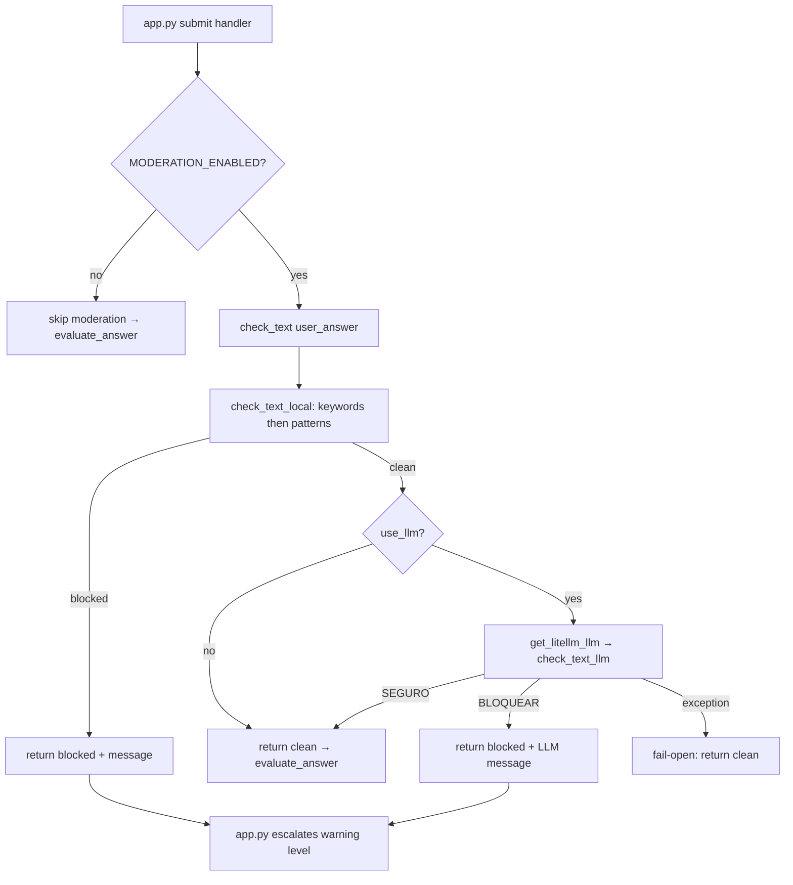

# Content Moderation System

Before a student answer reaches the LLM evaluator, it passes through content moderation in `src/content_filter.py`. The design is layered: a deterministic local check runs first and is the primary defense, an optional LLM semantic check runs second and is best-effort, and repeated violations are tracked in Streamlit session state and escalated through three warning levels.

## Responsibility and entry point

`check_text(text, use_llm=True)` is the single public entry point that `app.py` calls when the user submits an answer. It returns a `(blocked: bool, message: Optional[str])` tuple. A non-`None` message explains why the text was rejected; the app uses the boolean to decide whether to escalate a warning and the message to show the user. The whole call is gated in `app.py` by the `MODERATION_ENABLED` config flag — when that flag is false, `check_text` is never called and every answer flows straight to evaluation.

The spec (`openspec/specs/content-filter/spec.md`) codifies the contract: local keyword/pattern blocking, leet-speak normalization, optional LLM semantic moderation with a medical-context allowance, and the three-strike escalation.

## Layered order of checks

`check_text` runs the two layers in a fixed order:

1. **Local check (`check_text_local`)** — keywords first, then patterns. This is the primary defense. If it blocks, `check_text` returns immediately and the LLM is never consulted.
2. **LLM semantic check (`check_text_llm`)** — only when `use_llm=True` (the default) and the local check passed. This is best-effort: it fails open on any exception, returning `(False, None)` so a moderation-LLM outage does not block legitimate answers.

## Local keyword and pattern blocklist

`check_text_local` composes two deterministic checks. It runs `check_keywords` first; only if keywords are clean does it run `check_patterns`.

- **`check_keywords`** does a substring match against the `BLOCKED_KEYWORDS` set. The set covers Brazilian Portuguese and English terms across two categories — sexual and violent — including slang, slurs, and explicit terms. On a match it returns `(True, "Termo impróprio detectado: '<keyword>'")`, quoting the first matched keyword.
- **`check_patterns`** runs each entry in `BLOCKED_PATTERNS` (a list of regexes) with `re.IGNORECASE` over the normalized text. Matches return the generic message `"Conteúdo contém padrão bloqueado."` rather than naming a term. Each `re.search` is wrapped in a `try/except re.error` so a malformed pattern cannot crash the check. The patterns catch forms the keyword set misses — for example `\bporra\b` — and include a CJK glyph and a three-word spaced profanity pattern.

Because `check_keywords` uses substring matching, the keyword list must be conservative about short tokens; the pattern layer is where broader or spaced-out forms are caught.

## Leet-speak normalization

Both local checks normalize the input with `normalize_leet` before matching. `LEET_SPEAK_MAP = str.maketrans("aeiou43", "aeiou38")` is an unusual translation table: it leaves the vowels `aeiou` mapped to themselves and remaps the digits `4 → 3` and `3 → 8`, then `normalize_leet` lowercases the result. The vowel entries are no-ops, but the digit remap means a term like `f0d4` normalizes toward `f3d8`-style forms and the check runs against this transformed text. The point is that leet-speak obfuscation is flattened before keyword and pattern matching so simple numeric substitutions do not slip past the blocklist. `normalize_leet("4") == "3"` and `normalize_leet("3") == "8"` are the canonical, test-verified transformations.

## LLM semantic check and the medical-context exception

When the local check is clean and `use_llm` is true, `check_text` imports `get_litellm_llm` from `src.llm_service` and runs `check_text_llm`. The LLM used is the **primary LiteLLM model** (`LITELLM_MODEL` served through `LITELLM_API_BASE_URL`) — the same primary used for answer evaluation, not the OpenRouter fallback. The response content is flattened (it may be a string or a list of message blocks), stripped, lowercased, and classified:

- starts with `"bloquear"` → `(True, "Conteúdo impróprio identificado pela moderação semântica.")`
- otherwise → `(False, None)` (i.e. `SEGURO` allows the answer through)

The moderation prompt is in Portuguese and instructs the model to decide whether the text contains sexual or offensive content directed at others. Critically, it carries an **explicit dental/medical context exception**: because the quiz is about historical dental/medical instruments, the prompt tells the model that answers may legitimately contain words or expressions related to medical and dental procedures — such as *perfuração de crânio*, *cirurgia*, *sangue* — and that these must not be blocked. This prevents the LLM (and, by intent, the local blocklist's breadth) from false-flagging clinically accurate student answers about surgical instruments.

`check_text_llm` itself does not catch exceptions; `check_text` wraps the whole LLM block in `try/except Exception` and **fails open**: on any error (timeout, 401, import failure, unavailable model) it logs nothing and returns `(False, None)`. The rationale, stated in the source comment, is that the local keyword filter already ran above and is the primary defense; LLM moderation is best-effort. The tests confirm this with `test_check_text_returns_clean_when_llm_raises`.

The LLM semantic pass is only invoked when `use_llm=True` (the default). `check_text(user_answer)` in `app.py` uses the default, so the LLM pass is active whenever `MODERATION_ENABLED` is true. Passing `use_llm=False` skips `check_text_llm` entirely — verified by `test_check_text_skips_llm_when_disabled`.

## Three-strike warning escalation

Repeated violations are tracked in Streamlit session state by `app.py`, not by the filter. `get_warning_level(warnings: int)` maps a violation count to a level label:

| `warnings` | Level | UI treatment in `app.py` |
|---|---|---|
| `0` | `"none"` | no moderation action |
| `1` | `"first"` | `st.warning` — first warning |
| `2` | `"second"` | `st.warning` — second and final warning |
| `≥ 3` | `"blocked"` | `st.error` and `moderation_blocked = True` |

The flow in `app.py` is: when `check_text` returns blocked, it increments `st.session_state.moderation_warnings`, computes the level, and on `"first"`/`"second"` shows a warning combining the block message and an admonition. On `"blocked"` it sets `st.session_state.moderation_blocked = True` and shows a permanent `st.error`. Once `moderation_blocked` is true, the submit handler short-circuits before any further checks and shows a "session blocked, reload to retry" error, and the answer is never evaluated. The warning count lives only in session state and resets on a page reload or new browser session (verified by the spec's "warning count resets on new session" scenario).

If the answer is not blocked, `app.py` proceeds to `_process_answer()` → `evaluate_answer()` — the LLM evaluation flow described in the LLM fallback and answer-evaluation workflows.

## Configuration and operational knobs

- **`MODERATION_ENABLED`** (`src/config.py`) — env var, defaults to `"true"`; parsed case-insensitively to a bool. When false, `app.py` skips the entire `check_text` call, so moderation warnings are never shown and no LLM moderation cost is incurred.
- **`use_llm`** — the `check_text` parameter (default `True`). When false the LLM semantic pass is skipped; the local check still runs. This is the lever for running zero-cost, local-only moderation.
- **`LITELLM_MODEL` / `LITELLM_API_BASE_URL` / `LITELLM_API_KEY`** — the primary model that `check_text_llm` uses via `get_litellm_llm`. The moderation call uses the default `temperature=0.7` of the returned `ChatOpenAI`; there is no moderation-specific temperature setting.

Note: the Integrations page references moderation temperature 0.1 and an OpenRouter moderation usage, but the current source routes the LLM moderation exclusively through the LiteLLM primary model with no per-call temperature override.

## Tests that matter

`tests/test_content_filter.py` pins the behavior of each layer and the fail-open semantics:

- Keyword blocking across all four categories — `test_check_keywords_blocks_term_in_each_category` parametrizes a PT-sexual, PT-violent, EN-sexual, and EN-violent term and asserts each is blocked with the term in the message.
- Leet normalization — `test_normalize_leet_lowercases_input` and `test_normalize_leet_applies_digit_translation_table` assert `FODA → foda`, `4 → 3`, `3 → 8`; `test_check_keywords_leet_normalization_detects_blocked_word` confirms an uppercased blocked term is still caught.
- Local composition — `test_check_text_local_returns_keyword_block_for_blocked_term`, `..._returns_pattern_block_when_keywords_clean`, and `..._returns_clean_tuple_for_clean_text` pin the keyword-then-pattern ordering and the clean tuple.
- `get_warning_level` — `test_get_warning_level_escalates_per_count` parametrizes `0→none, 1→first, 2→second, 3→blocked`.
- LLM pass — `test_check_text_llm_blocks_mocked_llm_classification` confirms a `"BLOQUEAR"` response blocks; `test_check_text_skips_llm_when_text_is_blocked_locally` confirms the LLM is not called when the local check already blocked; `test_check_text_invokes_llm_once_for_clean_text` confirms the LLM is called once for clean text with the real `get_litellm_llm`; `test_check_text_returns_clean_when_llm_raises` confirms fail-open; `test_check_text_skips_llm_when_disabled` confirms `use_llm=False` never calls the LLM.

## Relationships

- **Called by** `app.py` (`check_text`, `get_warning_level`) as the moderation gate inside the submit handler, gated by `MODERATION_ENABLED`.
- **Depends on** `src/llm_service.get_litellm_llm` for the semantic LLM pass — the same primary LiteLLM model used for answer evaluation; it does **not** use the OpenRouter fallback.
- **Specified by** `openspec/specs/content-filter/spec.md`, which records the two-layer contract, the medical-context allowance, and the three-strike escalation.
- **Related** to the [LLM Fallback](/openwiki/concepts/llm-fallback.md) and [Answer Evaluation Flow](/openwiki/workflows/answer-evaluation-flow.md) concepts: moderation is the gate that runs before `evaluate_answer`, and its LLM call reuses the primary provider rather than the fallback chain.
