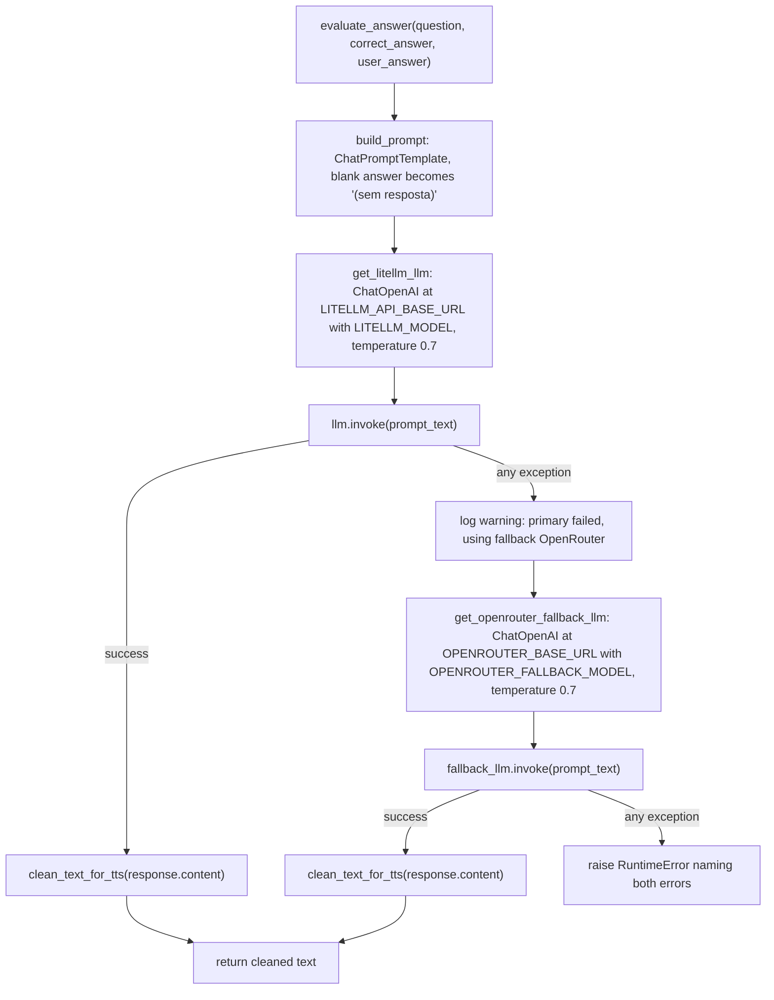

# LLM Provider Fallback

`src/llm_service.py` is the module that turns a moderated student answer into spoken feedback. It does three things: builds a grading prompt, invokes a two-tier LLM provider chain (primary LiteLLM server with an OpenRouter fallback), and cleans the returned text for text-to-speech consumption. `app.py` is its only caller, invoking `evaluate_answer(question, correct_answer, user_answer)` inside the submit handler once content moderation has allowed the answer through.

## Two-tier provider strategy

The module exposes two provider constructors, both built on the same LangChain primitive:

- **Primary** — `get_litellm_llm()` returns a `ChatOpenAI` instance pointed at `LITELLM_API_BASE_URL` using model `LITELLM_MODEL` (the example config uses `glm-4.7-flash:q4_K_M`) and `LITELLM_API_KEY`, at `temperature=0.7`. The LiteLLM server fronts an Ollama backend.
- **Fallback** — `get_openrouter_fallback_llm()` returns a `ChatOpenAI` instance pointed at `OPENROUTER_BASE_URL` (default `https://openrouter.ai/api/v1`, OpenRouter's OpenAI-compatible endpoint) using model `OPENROUTER_FALLBACK_MODEL` (the example config uses `nvidia/nemotron-3-nano-30b-a3b:nitro`) and `OPENROUTER_API_KEY`, also at `temperature=0.7`.

Both constructors use `langchain_openai.ChatOpenAI` with the API key wrapped in `pydantic.SecretStr` (`api_key=SecretStr(...)`). This is a deliberate, structurally enforced consequence of using `ChatOpenAI`: because both the primary LiteLLM server and OpenRouter expose OpenAI-compatible HTTP endpoints, the same `ChatOpenAI` client is reused for both — only `base_url`, `model`, and `api_key` differ. There is no OpenAI-the-company dependency; the client is an OpenAI-protocol client pointed at two different proxies.

The provider chain itself lives in `evaluate_answer()`. It invokes the primary `ChatOpenAI` first; on **any** exception from `llm.invoke(prompt_text)` it logs a warning (naming the failed `LITELLM_MODEL`) and invokes the fallback; if the fallback also raises, it raises a `RuntimeError` whose message names both the primary error and the fallback error. The same `prompt_text` built by `build_prompt()` is passed to whichever provider runs, and the `response.content` of whichever provider succeeds is run through `clean_text_for_tts()` before being returned.



Fallback decision in `evaluate_answer`: primary LiteLLM succeeds → returned; on any primary exception the OpenRouter fallback is tried and its cleaned response is returned; if the fallback also fails, a `RuntimeError` is raised naming both errors.

## The grading prompt

`build_prompt(question, correct_answer, user_answer)` constructs a `ChatPromptTemplate` from two messages and returns the fully formatted prompt string:

1. **System message** — a fixed string instructing the model to act as a friendly, enthusiastic Brazilian-Portuguese quiz professor. It directs the model to analyze the user's answer, give motivating feedback when the answer is wrong, then explain the correct answer didactically (covering *what*, *what it's for*, *how it was used*, and *how it was replaced today*). It constrains the output: respond in natural spoken Brazilian Portuguese, **no markdown, bold, italic, or special formatting**, short sentences, and a hard **maximum of 500 characters**. It also carries an in-prompt moderation clause: if the student submits sexual, violent, offensive, or otherwise inappropriate content, the model is to politely refuse and redirect them to maintain respect in the educational environment, and to neither evaluate nor comment on the inappropriate content.
2. **Human message** — a template with `Pergunta: {question}`, `Resposta correta: {correct_answer}`, `Resposta do usuário: {user_answer}`, followed by `Avalie a resposta e explique de forma didática.`

The format step substitutes the variables. A blank `user_answer` — one whose `.strip()` is falsy — is replaced with the literal string `(sem resposta)` so the model never sees an empty "user answer" field. This is the only normalization `build_prompt` performs; it does not alter the question or correct answer.

## Response cleaning for TTS

`clean_text_for_tts(text)` normalizes LLM output into plain, speakable text before it is handed to `edge-tts`:

1. Strip markdown emphasis/heading/inline-code markers: `*`, `#`, `_`, `~`, and backticks are removed.
<!-- openwiki: broken internal link [url] file "url" does not exist. Fix the href or restore the target, then delete this comment. -->
2. Convert markdown links `[text](url)` to just the link text `text`.
3. Collapse runs of two or more newlines into a single `. ` (period-space), turning paragraph breaks into sentence boundaries.
4. Replace any remaining single newlines with spaces.
5. Collapse all runs of whitespace to a single space and strip leading/trailing whitespace.

The result is a flat, punctuated string suitable for speech synthesis. The cleaning is applied identically to whichever provider's response succeeds, and only to the successful response — the failed provider's exception is never cleaned, it is either logged (primary) or folded into the `RuntimeError` (fallback).

## Total failure behavior

When both providers raise, `evaluate_answer` raises a single `RuntimeError` whose message is:

```
Falha total na avaliação por LLM: ambos os provedores falharam.
Erro primário (LiteLLM/modelo {LITELLM_MODEL}): {primary_error}.
Erro de fallback (OpenRouter/modelo {OPENROUTER_FALLBACK_MODEL}): {fallback_exc}
```

The message explicitly names both the primary `LITELLM_MODEL` and the fallback `OPENROUTER_FALLBACK_MODEL`, and embeds both exceptions' `str()` so the operator can diagnose the underlying cause (a LiteLLM timeout vs. an OpenRouter 401, for instance). The exception is raised `from fallback_exc`, preserving the fallback's traceback as the cause. `app.py` catches this inside the submit handler's `_process_answer()` and surfaces it as `st.error(f"Erro ao processar: {e}")`, so the user sees a generic error rather than a raw traceback, and the session is not otherwise corrupted.

## Configuration

The provider chain is driven entirely by environment variables read at import time in `src/config.py` and re-read by the test fixture via `monkeypatch.setenv` + `importlib.reload`. The required variables are enforced by `validate_config()` (called from `main()` at startup, not at import time):

| Constant | Env var | Required | Default | Used by |
|---|---|---|---|---|
| `LITELLM_API_BASE_URL` | `LITELLM_API_BASE_URL` | yes | — | `get_litellm_llm` base_url |
| `LITELLM_API_KEY` | `LITELLM_API_KEY` | yes | — | `get_litellm_llm` (SecretStr) |
| `LITELLM_MODEL` | `LITELLM_MODEL` | yes | — | `get_litellm_llm` model; also embedded in warning and RuntimeError |
| `OPENROUTER_API_KEY` | `OPENROUTER_API_KEY` | yes | — | `get_openrouter_fallback_llm` (SecretStr) |
| `OPENROUTER_FALLBACK_MODEL` | `OPENROUTER_FALLBACK_MODEL` | yes | — | `get_openrouter_fallback_llm` model; embedded in RuntimeError |
| `OPENROUTER_BASE_URL` | `OPENROUTER_BASE_URL` | no | `https://openrouter.ai/api/v1` | `get_openrouter_fallback_llm` base_url |

`LITELLM_MODEL` and `OPENROUTER_FALLBACK_MODEL` are not just operational knobs: they are interpolated into the fallback warning log and the total-failure `RuntimeError`, so changing them changes the diagnostics an operator sees. Both providers are constructed with `temperature=0.7` — the moderation LLM in `content_filter.py` reuses the primary `get_litellm_llm()` for its own (non-fallback) semantic check, so the primary constructor is shared between answer evaluation and LLM moderation.

## Tests that pin the contract

`tests/test_llm_service.py` pins the three legs of the contract with `ChatOpenAI` mocked at the `get_litellm_llm`/`get_openrouter_fallback_llm` boundary (not at the HTTP layer), reloading `src.llm_service` with test env vars per fixture:

- `test_build_prompt_contains_question_correct_answer_and_user_answer` — the three inputs appear in the formatted prompt.
- `test_build_prompt_marks_blank_user_answer_as_unanswered` — a blank user answer yields the literal `(sem resposta)` in the prompt.
- `test_clean_text_for_tts_removes_markdown_and_normalizes_whitespace` — asserts that `**Correto!** Veja [este link](https://example.com)\n\n## _Mais_   \`detalhes\` ~~agora~~` cleans to `Correto! Veja este link. Mais detalhes agora` (markdown stripped, link reduced to label, double-newline collapsed to `. `, backticks and strikethrough removed, whitespace collapsed).
- `test_evaluate_answer_uses_litellm` — the primary is invoked once with the exact built prompt; the fallback is never constructed; the return value equals `clean_text_for_tts` of the primary's content.
- `test_evaluate_answer_uses_fallback_when_primary_fails` — when the primary raises, the fallback is invoked and its cleaned content is returned.
- `test_evaluate_answer_raises_on_both_failures` — when both providers raise, a `RuntimeError` is raised whose message contains `ambos os provedores falharam` plus both the primary and fallback error strings.

## Relationships

- **Called by** `app.py` (`evaluate_answer`) as the step after content moderation in the submit handler; its output is stored in `st.session_state.response_text` and passed to `generate_speech` for TTS.
- **Shares the primary provider with** `src/content_filter.py`, which imports `get_litellm_llm` for its own LLM semantic moderation pass (the moderation pass does **not** use the OpenRouter fallback — it fails open instead).
- **Specified by** `openspec/specs/llm-evaluation/spec.md` (the answer-evaluation and TTS-cleaning contract) and `openspec/specs/llm-fallback/spec.md` (the two-tier fallback and total-failure contract).
- **Related to** the [Content Moderation](/openwiki/concepts/content-moderation.md) concept (which gates this call and reuses the primary provider), the [Architecture Overview](/openwiki/architecture.md) (which places this module in the end-to-end pipeline), and the [Integrations](/openwiki/integrations.md) and [Operations](/openwiki/operations.md) references (which list the env vars and the OpenAI-compatible endpoint).
