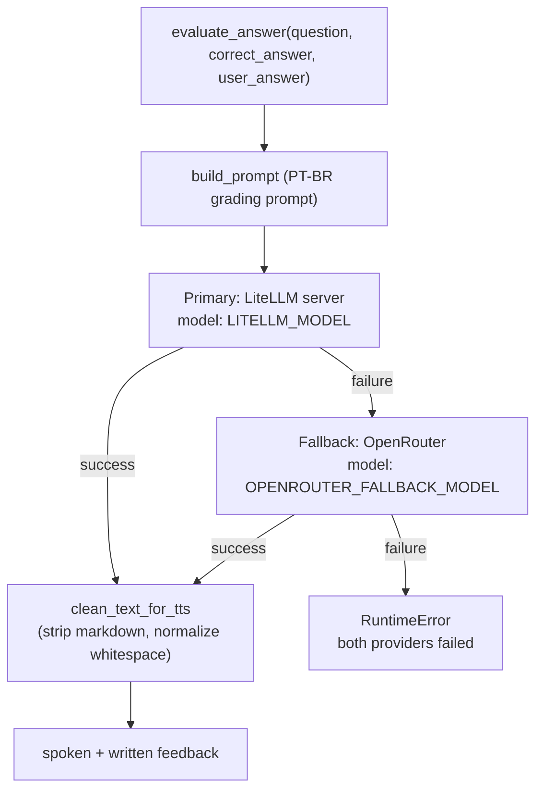

# Quiz do Professor — Quickstart

An interactive quiz for dental/medical students built with **Streamlit**, **LangChain**, and **edge-tts**. A cartoon "professor" avatar evaluates the student's answer through an LLM and reads the feedback aloud via text-to-speech. Questions can be shared by link or QR Code.

**Language:** Brazilian Portuguese (pt-BR). All UI text, LLM prompts, and question content are in Portuguese.

## Tech Stack

| Layer | Technology |
|---|---|
| Frontend | Streamlit (single-page app, `?q=<id>` query-param routing) |
| LLM | LiteLLM server (primary, Ollama backend) → OpenRouter (fallback), both via LangChain `ChatOpenAI` |
| TTS | edge-tts (`pt-BR-FranciscaNeural`) |
| Avatar | Programmatic PIL-drawn scientist GIF, cached to disk under `assets/` |
| Moderation | Local keyword blocklist (PT + EN, sexual/violent) + optional LLM semantic check |
| QR Sharing | `qrcode` library generates scannable question links |
| Config | python-dotenv (`.env` file) |
| Tests | pytest (`pytest.ini` sets `testpaths=tests`, `pythonpath=src`) |

## Quick Start

```bash
# 1. Clone and enter the repo
git clone <repo-url> && cd quiz

# 2. Create and activate a virtual environment (Python 3.10+)
python -m venv .venv
.venv\Scripts\activate        # Windows
# source .venv/bin/activate   # Linux/macOS

# 3. Install dependencies
pip install -r requirements.txt

# 4. Configure environment
copy .env.example .env        # Windows
# cp .env.example .env        # Linux/macOS
# Edit .env and fill LITELLM_* (primary) and OPENROUTER_* (fallback)

# 5. Run
streamlit run app.py
```

The app opens at `http://localhost:8501`. `app.py` is the Streamlit entrypoint and orchestrates the whole flow.

### Local QR links

By default `APP_URL` points at the public deployment (`https://lappquiz.ict.unesp.br`), so shared links and QR Codes resolve there. For local testing, set `APP_URL=http://localhost:8501` in `.env` so the generated links and QR Codes point at your own `streamlit run` instance.

## Key Environment Variables

The LLM runs as a two-tier provider: **LiteLLM is primary** and **OpenRouter is the automatic fallback**. The old single-provider setup (`LLM_MODEL` / OpenRouter as primary / DeepSeek) has been replaced — see [Operations & Configuration](operations.md) for the full migration path.

| Variable | Required | Default | Description |
|---|---|---|---|
| `LITELLM_API_BASE_URL` | yes | — | LiteLLM server URL (primary), e.g. `http://localhost:4000` |
| `LITELLM_API_KEY` | yes | — | Virtual auth key for the LiteLLM server |
| `LITELLM_MODEL` | yes | — | Primary model, e.g. `glm-4.7-flash:q4_K_M` |
| `OPENROUTER_API_KEY` | yes | — | OpenRouter API key (used only for fallback) |
| `OPENROUTER_FALLBACK_MODEL` | yes | — | Model used when LiteLLM fails, e.g. `nvidia/nemotron-3-nano-30b-a3b:nitro` |
| `OPENROUTER_BASE_URL` | no | `https://openrouter.ai/api/v1` | OpenRouter API base URL (fallback only) |
| `MODERATION_ENABLED` | no | `true` | Enables content moderation when `true` |
| `APP_URL` | no | `https://lappquiz.ict.unesp.br` | Base URL for shareable question links and QR Codes |
| `TTS_VOICE` | no | `pt-BR-FranciscaNeural` | edge-tts voice |
| `TEMP_AUDIO_DIR` | no | `tmp/audio` | Temp directory for generated audio files |

<!-- openwiki: broken internal link [.env.example] file ".env.example" does not exist. Fix the href or restore the target, then delete this comment. -->
See [.env.example](.env.example) for the template. All five LLM variables above are validated at startup by `validate_config()`; set `SKIP_CONFIG_VALIDATION=1` to bypass validation (used by tooling and tests).

## LLM Fallback at a Glance



The primary LiteLLM call runs first; only on failure does `evaluate_answer` fall back to OpenRouter. If both providers fail it raises a `RuntimeError` describing both errors. See [LLM Provider Fallback](concepts/llm-fallback.md) and [Answer Evaluation Workflow](workflows/answer-evaluation-flow.md).

## Tests

```bash
pytest
```

`pytest.ini` configures `testpaths = tests` and `pythonpath = src`, so tests import `src.*` directly without extra setup. CI (`.github/workflows/test.yml`) runs the suite on `ubuntu-latest` with Python 3.10, installing `requirements.txt` plus `requirements-dev.txt` (pytest) and running `pytest`. See [Testing Guidance](testing.md) for the mocking strategy and known gaps.

## Task-Routing Map

Use this to jump straight to the right page for a given change.

| If you are changing… | Go to |
|---|---|
| Answer evaluation or LLM fallback logic | [LLM Provider Fallback](concepts/llm-fallback.md) + [Answer Evaluation Workflow](workflows/answer-evaluation-flow.md) |
| Content moderation (blocklist, leet normalization, LLM check, three-strike escalation) | [Content Moderation System](concepts/content-moderation.md) |
| Environment variables, config validation, deployment, `APP_URL`/QR sharing behavior | [Operations & Configuration](operations.md) |
| Adding or editing a quiz question | `questions.json` + `src/quiz_data.py` (`load_questions`, `get_question_by_id`) — see [Source Map](source-map.md) |
| External services and libraries (LiteLLM/Ollama, OpenRouter, edge-tts, qrcode, PIL, Streamlit) | [External Integrations](integrations.md) |
| Tests, fixtures, mocking strategy, coverage gaps | [Testing Guidance](testing.md) |
| Component map, session-state model, end-to-end data flow | [Architecture Overview](architecture.md) |
| File-by-file reference with key symbols | [Source Map](source-map.md) |

## Repository Structure (Top Level)

```
quiz/
├── app.py                    # Streamlit entrypoint and orchestration
├── questions.json            # Quiz question bank (5 items)
├── requirements.txt          # Runtime dependencies
├── requirements-dev.txt      # pytest (dev/test dependency)
├── .env.example              # Environment template
├── assets/                   # Generated/cached avatar GIFs
├── src/                      # Application modules
│   ├── avatar.py             # PIL-based scientist avatar
│   ├── config.py             # Environment config loader + validation
│   ├── content_filter.py     # Two-layer moderation
│   ├── llm_service.py        # LangChain LLM: LiteLLM primary, OpenRouter fallback
│   ├── qrcode_service.py     # QR code generation for question sharing
│   ├── quiz_data.py          # Question JSON loader
│   └── tts_service.py        # edge-tts wrapper
├── tests/                    # pytest suite (test_app, test_llm_service, ...)
├── openspec/                 # OpenSpec change management
├── .opencode/                # OpenCode commands/skills
├── .github/                  # CI workflows
└── openwiki/                 # This documentation
```

## Backlog

| Area | Source | Reason deferred |
|---|---|---|
| Question content management | `questions.json` (5 items) | No admin interface; questions are manually edited JSON |
| User authentication | `app.py` session state | No auth layer; relies on Streamlit's anonymous sessions |
| Database persistence | `app.py` session state only | All state is in-memory Streamlit session; no DB |
| Multi-language support | Hardcoded pt-BR | All UI, prompts, and content are Portuguese-only |
