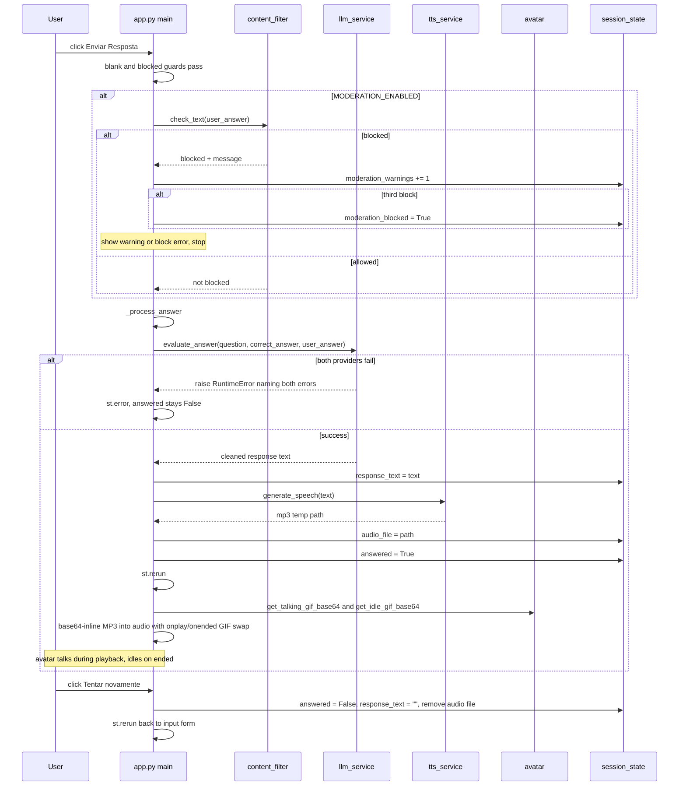

# Answer Evaluation Workflow

This page traces one answer submission from the moment the user clicks **Enviar Resposta** to the moment the professor avatar finishes speaking or the user retries. It is the runtime control flow that `app.py`'s `main()` drives on every submit, and the shared spine that the [Content Moderation](/openwiki/concepts/content-moderation.md), [LLM Fallback](/openwiki/concepts/llm-fallback.md), and [Integrations](/openwiki/integrations.md) pages hang off of. The whole flow lives in a single handler inside `main()`; there is no separate controller, queue, or background job.

## Entry preconditions

The handler only runs once the page has resolved a valid question:

- `st.query_params` provided a `q` parameter, it parsed as an `int`, and `get_question_by_id` found the question. Missing `q`, a non-integer `q`, or an unknown id each short-circuit with a Streamlit info/error and `return` before the answer UI is ever rendered.
- The page is in the **unanswered** branch (`st.session_state.answered` is falsy), which renders the `st.text_input` and the **Enviar Resposta** button. The answered branch is a separate render path described later.
- The session-state keys exist: they are initialized once on first load — `answered`, `response_text`, `audio_file`, `moderation_warnings` (starting at `0`), and `moderation_blocked` (starting at `False`).

## Submit handler control flow

When **Enviar Resposta** is clicked, the handler runs a sequence of guards and then either escalates a moderation warning or dispatches to `_process_answer`. The diagram below captures the branching.

<!-- openwiki: mermaid parse failed and this diagram was converted to a text fence so it does not break rendering. Fix the diagram source and restore the mermaid fence. Parser error: Heuristic: a semicolon inside a label breaks rendering; rephrase the label. -->
```text
flowchart TD
    Click["User clicks Enviar Resposta"] --> Blank{"user_answer.strip() empty?"}
    Blank -- "yes" --> WarnBlank["st.warning: type an answer first"]
    Blank -- "no" --> Blocked{"session_state.moderation_blocked?"}
    Blocked -- "yes" --> ErrBlocked["st.error: session blocked, reload to retry"]
    Blocked -- "no" --> ModEn{"MODERATION_ENABLED?"}
    ModEn -- "no" --> Proc["_process_answer"]
    ModEn -- "yes" --> Check["st.spinner: check_text(user_answer)"]
    Check --> IsBlk{"is_blocked?"}
    IsBlk -- "no" --> Proc
    IsBlk -- "yes" --> Incr["moderation_warnings += 1"]
    Incr --> Lvl["get_warning_level(warnings)"]
    Lvl -- "first" --> Warn1["st.warning: first warning"]
    Lvl -- "second" --> Warn2["st.warning: second and final warning"]
    Lvl -- "blocked" --> SetBlk["moderation_blocked = True; st.error: blocked"]
```

The submit handler: blank-answer guard, blocked-session guard, optional moderation gate with three-strike escalation, and dispatch to `_process_answer` when the answer is allowed.

The guards execute in a fixed, short-circuiting order:

1. **Blank-answer guard** — `if not user_answer.strip(): st.warning("Por favor, digite uma resposta antes de enviar.")`. An empty (or whitespace-only) answer is rejected with a warning and nothing else runs. This guard is independent of `MODERATION_ENABLED`.
2. **Blocked-session guard** — `elif st.session_state.get("moderation_blocked", False): st.error(...)`. Once a session is blocked, the handler stops before any moderation check or evaluation. The error message tells the user to reload the page to retry; the block is not cleared by this button.
3. **Moderation gate** — only when `MODERATION_ENABLED` is true. `check_text(user_answer)` runs inside an `st.spinner("Verificando conteúdo...")` and returns `(is_blocked, block_msg)`.
   - If **not blocked**, dispatch to `_process_answer()`.
   - If **blocked**, increment `st.session_state.moderation_warnings`, compute `get_warning_level(warnings)`, and escalate:
     - `"first"` → `st.warning` combining `block_msg` and "Esta é sua primeira advertência. Por favor, mantenha o respeito."
     - `"second"` → `st.warning` combining `block_msg` and "Esta é sua segunda advertência. Uma última chance antes do bloqueio."
     - anything else (`"blocked"`) → set `st.session_state.moderation_blocked = True` and `st.error("🚫 Você excedeu o número de tentativas com conteúdo impróprio. Sua sessão foi bloqueada.")`.

When `MODERATION_ENABLED` is false, the handler skips `check_text` entirely and calls `_process_answer()` directly — no warnings can be issued and `moderation_warnings` never increments.

### Moderation side effects on session state

The handler, not `content_filter.py`, owns the warning state. The transitions are:

- `moderation_warnings` **increments by one** on every blocked `check_text` result (first, second, and third alike). It is only ever read and written inside this blocked branch.
- `moderation_blocked` is **set to `True` only on the third block** — i.e. after `moderation_warnings` has been incremented to `3` and `get_warning_level` returns `"blocked"`. The first and second blocks leave it `False`.
- Once `moderation_blocked` is `True`, the blocked-session guard at the top of the handler fires on every subsequent submit for this session, so no further moderation check or evaluation runs. The only way out is a page reload (a new Streamlit session reinitializes the keys), because the handler never resets `moderation_blocked` itself.

`get_warning_level` maps the count deterministically: `0 → "none"`, `1 → "first"`, `2 → "second"`, `≥ 3 → "blocked"`. Because the increment happens before the level lookup, the first blocked submission yields `"first"`, the second yields `"second"`, and the third yields `"blocked"` and flips `moderation_blocked`.

## `_process_answer` — evaluation, TTS, and the answered transition

`_process_answer` is a nested closure that runs the expensive work under spinners and then flips the session into the answered render path. Its body:

1. `with st.spinner("🤔 O professor está pensando..."):` call `evaluate_answer(question["question"], question["correct_answer"], user_answer)` and store the result in `st.session_state.response_text`.
2. `with st.spinner("🎙️ Gerando áudio da resposta..."):` call `generate_speech(response_text)` and store the returned temp-file path in `st.session_state.audio_file`.
3. Set `st.session_state.answered = True`.
4. Call `st.rerun()` so Streamlit re-executes `main()` top-to-bottom, this time taking the answered branch.

The entire body is wrapped in `try/except Exception as e: st.error(f"Erro ao processar: {e}")`. This is the single catch that surfaces both the evaluation and TTS failures to the user (see [Failure handling](#failure-handling)). On an exception, `answered` is **not** set to `True`, so the page stays on the input branch and the user can correct and resubmit without a retry.

## The answered-state render path

After `st.rerun()`, `main()` re-enters with `st.session_state.answered` true and renders the result instead of the input form. The render has three parts:

1. **Response text** — `st.markdown(f'<div class="response-text">{st.session_state.response_text}</div>', unsafe_allow_html=True)` shows the cleaned LLM feedback inside the `.response-text` styled div.
2. **Avatar + audio** — only when `st.session_state.audio_file` is truthy **and** `os.path.exists(audio_file)` is true. Inside a `try/except Exception as e: st.warning(f"Não foi possível reproduzir o áudio: {e}")` block it:
   - loads the talking and idle GIFs via `get_talking_gif_base64()` and `get_idle_gif_base64()`;
   - reads the temp MP3 file and `base64.b64encode`s it;
   - builds an inline HTML block with an `` showing the **talking** GIF by default, plus an `<audio id="prof-audio" autoplay controls>` whose `<source>` is the base64 MP3;
   - the `onplay` handler swaps `prof-gif.src` to the talking GIF and the `onended` handler swaps it back to the idle GIF — so the avatar visibly "talks" while the audio plays and returns to idle when it finishes;
   - injects the block via `streamlit.components.v1.html(sync_html, height=250)`.
   Any exception (missing file, base64 failure, component error) becomes `st.warning` rather than crashing the page.
3. **Retry button** — `st.button("🔄 Tentar novamente", use_container_width=True)`. When clicked it resets the session back to the unanswered state: sets `answered = False`, clears `response_text` to `""`, and if `audio_file` is set it `os.remove`s the temp file (swallowing any `OSError`), sets `audio_file = None`, and calls `st.rerun()`. This **deletes the temp audio file** so stale MP3s do not accumulate in `tmp/audio` across retries.

The QR-code share block at the bottom of the page is rendered for both the answered and unanswered branches and is not part of this flow.

## End-to-end sequence

The sequence below shows the successful path from submit through evaluation, TTS, the rerun, and the avatar/audio render, plus the retry reset.



Successful answer submission: moderation gate, two-tier LLM evaluation, TTS, rerun into the answered render path with base64-inlined avatar/audio, and the retry reset that deletes the temp audio file.

## Failure handling

Three distinct failure surfaces map to three distinct Streamlit feedback widgets, all caught locally so the page never shows a raw traceback:

| Failure | Where raised | Caught by | User sees |
|---|---|---|---|
| `evaluate_answer` total failure (both LiteLLM primary and OpenRouter fallback raised) | `llm_service.evaluate_answer` raises `RuntimeError` naming both errors | `_process_answer`'s `try/except Exception` | `st.error(f"Erro ao processar: {e}")`; `answered` stays `False` |
| `generate_speech` TTS failure | `tts_service.generate_speech` removes the temp file and raises `RuntimeError("Falha ao gerar áudio TTS: ...")` | `_process_answer`'s `try/except Exception` | `st.error(f"Erro ao processar: {e}")`; `answered` stays `False` |
| Audio/avatar render failure | the answered-branch `try/except` around GIF loading, file reading, and `components.html` | that local `try/except Exception` | `st.warning(f"Não foi possível reproduzir o áudio: {e}")`; the response text still renders |

The first two share the same catch because they both happen inside `_process_answer` before `answered` is set — so on either failure the session stays on the input branch and the user can resubmit. A TTS failure that happens *after* `response_text` was already stored still leaves the input form visible (since `answered` was not yet set), but `response_text` remains in session state until overwritten. The render failure is the only one that can occur while `answered` is already `True`, and it is deliberately downgraded to a warning so the text response is not lost.

The moderation LLM's own fail-open behavior is handled one layer down: if the semantic LLM pass raises, `check_text` swallows it and returns `(False, None)`, so the answer proceeds to evaluation as if it were clean. That failure never reaches `_process_answer`.

## Session-state transitions

| Key | Before submit | On blocked answer | On successful answer | On retry |
|---|---|---|---|---|
| `answered` | `False` | `False` | `True` (then `st.rerun`) | reset to `False` |
| `response_text` | `""` | `""` | cleaned LLM text | reset to `""` |
| `audio_file` | `None` | `None` | temp MP3 path | `os.remove` then `None` |
| `moderation_warnings` | `0` | `+1` per block | unchanged | unchanged |
| `moderation_blocked` | `False` | `True` only on third block | unchanged | unchanged (stays `True` until reload) |

`moderation_warnings` and `moderation_blocked` are **never reset by the retry button** — only a page reload (new Streamlit session) clears them. This is intentional: the block is a session-level throttle, and retrying the same question does not forgive repeated abuse.

## Configuration and operational notes

- **`MODERATION_ENABLED`** (env, default `true`) is the single switch that adds or removes the moderation gate from the flow. When false, `check_text` is not called, `moderation_warnings` cannot increment, and every non-empty answer from a non-blocked session goes straight to `_process_answer`.
- **`OPENROUTER_API_KEY`** is additionally guarded at the top of `main()`: if unset, the app shows an `st.error` and `return`s before rendering any question, so the submit handler is unreachable.
- The two LLM providers' model names (`LITELLM_MODEL`, `OPENROUTER_FALLBACK_MODEL`) are interpolated into the `RuntimeError` message that surfaces through `st.error`, so an operator reading the error can tell which provider failed and why.
- The temp audio file lives under `TEMP_AUDIO_DIR` (default `tmp/audio`) and is removed only by the retry button; without a retry, one MP3 accumulates per answered question until the process or operator cleans the directory.

## Tests that pin the flow

`tests/test_app.py` loads `app.py` with stubbed `src.*` modules (Streamlit, content_filter, llm_service, tts_service, avatar, qrcode, quiz_data all replaced) and asserts the QR-URL construction against `APP_URL`. The submit-handler branching itself is exercised through the stubs: `check_text` is stubbed to `(False, None)`, `evaluate_answer` to `""`, and `generate_speech` to `None`, so the happy path (`_process_answer` → `st.rerun`) is covered, while the moderation escalation and failure paths are pinned by `tests/test_content_filter.py` (`get_warning_level`) and `tests/test_llm_service.py` (the `RuntimeError`-on-both-failures contract) respectively.

## Relationships

- **Orchestrator**: `app.py` `main()` is the sole driver; the flow is the body of its submit handler plus the nested `_process_answer` closure.
- **Gates**: [Content Moderation](/openwiki/concepts/content-moderation.md) — `check_text`/`get_warning_level` supply the block decision and the level labels; `MODERATION_ENABLED` gates whether the gate runs at all.
- **Evaluation**: [LLM Fallback](/openwiki/concepts/llm-fallback.md) — `evaluate_answer` runs the two-tier provider chain and raises the total-failure `RuntimeError` caught here.
- **TTS and avatar**: [Integrations](/openwiki/integrations.md) — `generate_speech` (edge-tts) and the PIL GIFs inlined into the answered render path.
- **Architecture**: [Architecture Overview](/openwiki/architecture.md) — places this flow in the end-to-end pipeline and the session-state model.
